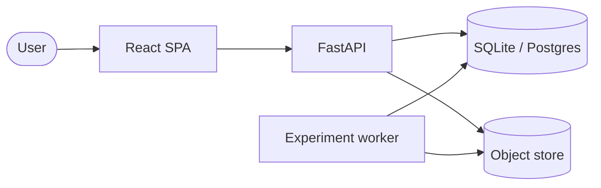

# VaaniQ

[](https://github.com/local/vaaniq/actions/workflows/ci.yml)
[](https://github.com/local/vaaniq/actions/workflows/docs.yml)
[](./backend/pyproject.toml)
[](./LICENSE)

**Cross-Lingual, Compression-Robust Detection and Calibrated Reliability Estimation for
AI-Generated Voice in Indian Languages, with a Human-Perception Baseline.**

Languages in scope: **Hindi (`hi`)**, **Marathi (`mr`)**, **Tamil (`ta`)**.
Telugu is **not** a project language (REQ-139).

> VaaniQ is a reproducible research system for studying multilingual audio-deepfake
> detection under language, codec, and confidence-calibration shift. It evaluates
> Hindi, Marathi, and Tamil; it does not claim universal deepfake detection.
>
> The approved evidence is a bounded, speaker-disjoint V1 benchmark built from
> Kathbath real speech and IndicSynth fake speech. Its main limitation is structural:
> source dataset and class label are associated. The partial V2 pilot does not yet
> remove that confound.
>
> **Frozen source of truth:** [`artifacts/final_results_manifest.json`](./artifacts/final_results_manifest.json),
> approved at commit `084bd47ca6ca1b69a7cdbf424e2946f3794c2a95`.

## Approved research status

| Experiment | Status | Canonical result |
|---|---|---|
| Baseline V1: acoustic embedding + AASIST-compatible head | **COMPLETE** | n=584; accuracy 91.61%; F1 91.36%; EER 6.56%; ROC-AUC 0.9729 |
| Frozen XLS-R main | **COMPLETE** | n=584; accuracy 92.12%; EER 6.88%; ROC-AUC 0.9828 |
| RQ1 compression | **COMPLETE** | Acoustic: clean 93.84% → WhatsApp-style Opus simulation 89.38%; XLS-R: 91.44% → 92.81% |
| RQ2 English-only transfer | **COMPLETE** | n=584; accuracy 54.8%; EER 76.56%; ROC-AUC 0.162; all predictions REAL at threshold 0.5 |
| RQ3 leave-one-language-out | **COMPLETE** | Hindi 78.83%; Marathi 93.29%; Tamil 93.94% accuracy |
| RQ4 calibration | **COMPLETE** | Validation-selected Baseline V1 strategy; held-out ECE 0.0245 → 0.026 |
| LFCC-GMM | **COMPLETE** | Accuracy 54.79%; EER 23.48%; ROC-AUC 0.8195 |
| RawNet2-style approximate baseline | **COMPLETE** | Accuracy 54.79%; EER 43.18%; ROC-AUC 0.5845; not faithful RawNet2 |
| Benchmark V2 | **PARTIAL** | External-source pilot; source probe 98.48%, so source identity remains highly predictable |
| FLEURS unseen-real evaluation | **PILOT** | n=9; no statistically useful unseen-source estimate claimed |
| Generator-disjoint evaluation | **PENDING** | n=0; no result claimed |
| Faithful RawNet2 | **PENDING** | Not implemented |
| RQ5 human study | **BLOCKED ON HUMAN DATA** | Human-study protocol ready; participant data collection pending (N=0) |

### Reproduce and verify persisted results

```bash
cd backend
uv pip install -e ".[dev,data,docs]"
uv run python ../scripts/verify_research_integrity.py   # must exit 0
```

The commands above verify existing evidence; they do not retrain models. Documentation
is generated from the frozen manifest. See `docs/TRAINING_GUIDE.md` for experimental
entry points and provenance.

## Architecture (C4 container sketch)



Full design: [`docs/SYSTEM_ARCHITECTURE.md`](./docs/SYSTEM_ARCHITECTURE.md).
Roadmap: [`docs/PROJECT_ROADMAP.md`](./docs/PROJECT_ROADMAP.md).

## Full install on a new PC

Step-by-step for another machine (folder map, Windows fixes, Docker, research CLI):
**[`INSTALL_AND_RUN.md`](./INSTALL_AND_RUN.md)**.

## 5-minute quickstart

Prerequisites: **Python 3.11**, [**uv**](https://github.com/astral-sh/uv), **Node.js 22+**.

On Windows, if `uvicorn.exe` is blocked by Application Control, use:
`uv run python -m uvicorn ...` (see `INSTALL_AND_RUN.md`).

### 1. Clone and env

```bash
git clone <this-repo> broscapstone
cd broscapstone
cp .env.example .env
cp frontend/.env.example frontend/.env
```

### 2. Backend API

```bash
cd backend
uv venv
uv pip install -e ".[dev]"
uv run uvicorn vaaniq.api.app:create_app --factory --reload --host 127.0.0.1 --port 8000
```

Check: open [http://127.0.0.1:8000/health](http://127.0.0.1:8000/health) → `{"status":"ok"}`.
OpenAPI: [http://127.0.0.1:8000/docs](http://127.0.0.1:8000/docs).

### 3. Frontend (second terminal)

```bash
cd frontend
npm ci
npm run dev
```

Open [http://127.0.0.1:5173](http://127.0.0.1:5173). The shell shows an **API ok** chip when
`GET /health` succeeds (frontend↔backend loop).

### 4. Gates (optional)

```bash
# GNU make (Linux/macOS/Git Bash)
make check

# Windows PowerShell
powershell -File scripts/check_all.ps1

# Or manually:
cd backend && uv run ruff check src tests && uv run mypy --strict src && uv run pytest
cd frontend && npm run typecheck && npm run lint && npm run test
```

### Docker (optional)

Requires Docker Desktop. See [`deployment/README.md`](./deployment/README.md).

```bash
docker compose -f deployment/docker-compose.yml up --build
# Web http://localhost:8080  ·  API http://localhost:8000/health
```

## Documentation

| Doc | Contents |
|-----|----------|
| [DEVELOPER_GUIDE](./docs/DEVELOPER_GUIDE.md) | Tooling, layout, conventions |
| [API](./docs/API.md) | HTTP surface & OpenAPI types |
| [DATASETS](./docs/DATASETS.md) | Corpora, licences, manifests |
| [TRAINING](./docs/TRAINING.md) | Seeds, manifests, baselines |
| [DEPLOYMENT](./docs/DEPLOYMENT.md) | Compose, Spaces, ops |
| [RESEARCH](./docs/RESEARCH.md) | RQs, metrics, paper track |
| [EXPERIMENTS](./docs/EXPERIMENTS.md) | Run layout under `research/` |
| [CONTRIBUTING](./docs/CONTRIBUTING.md) | PRs, commits, gates |
| [REQUIREMENTS](./docs/REQUIREMENTS.md) | REQ catalogue (Phase 0) |
| [OPEN_QUESTIONS](./docs/OPEN_QUESTIONS.md) | OQ tracker |

## Project languages

Iterate `Language` / `LANGUAGES` in code — never hardcode language lists.
Guard: `python scripts/check_no_telugu.py`.

## License

MIT — see [`LICENSE`](./LICENSE). Dataset redistributions must honour upstream licences
(see OQ-035 / `docs/DATASETS.md`).
