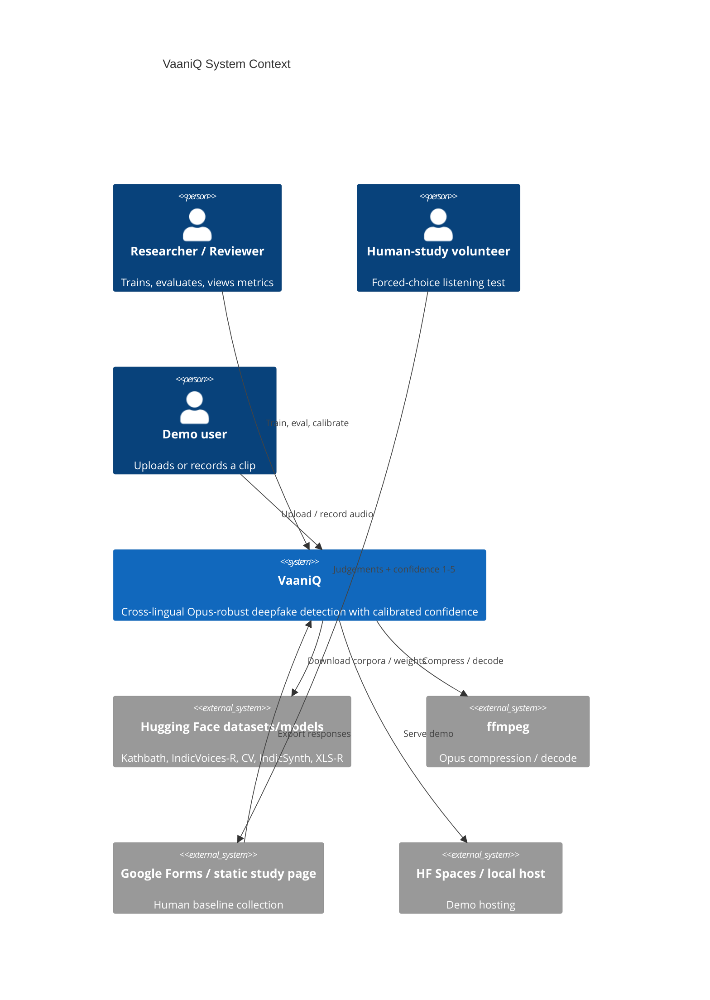
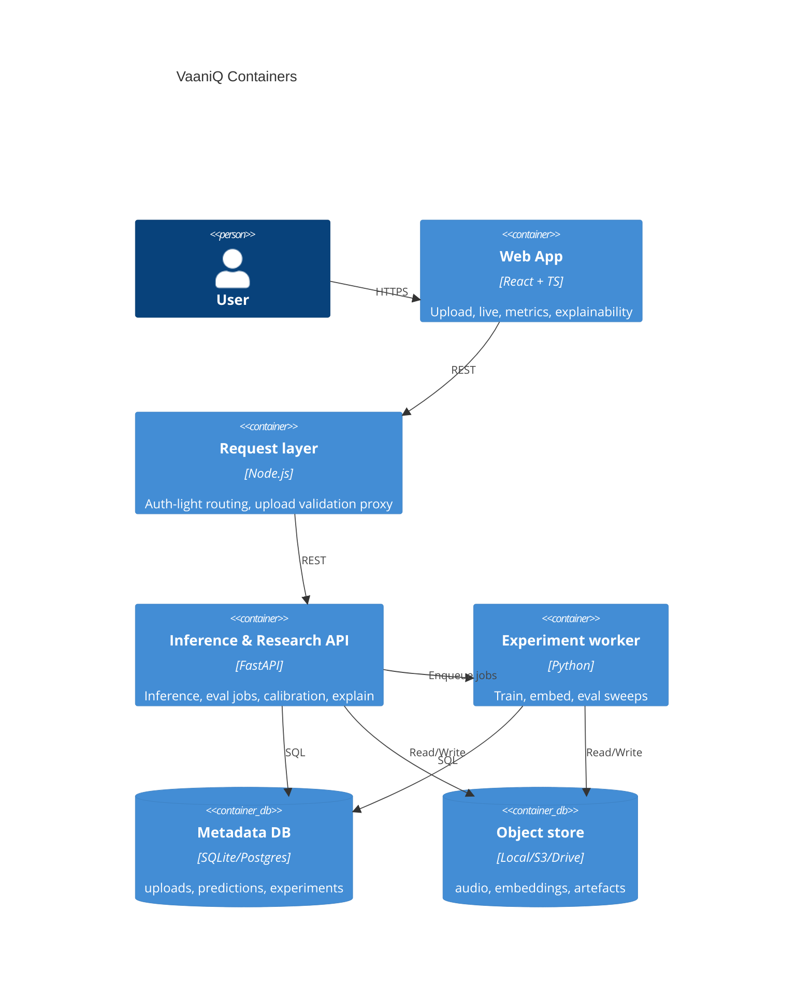
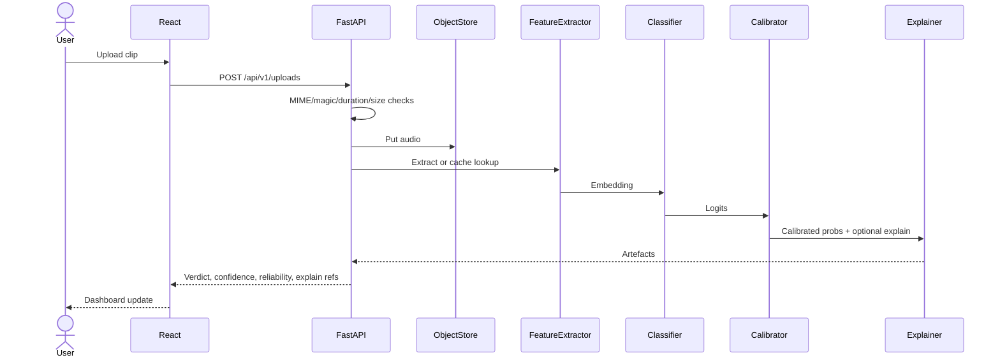
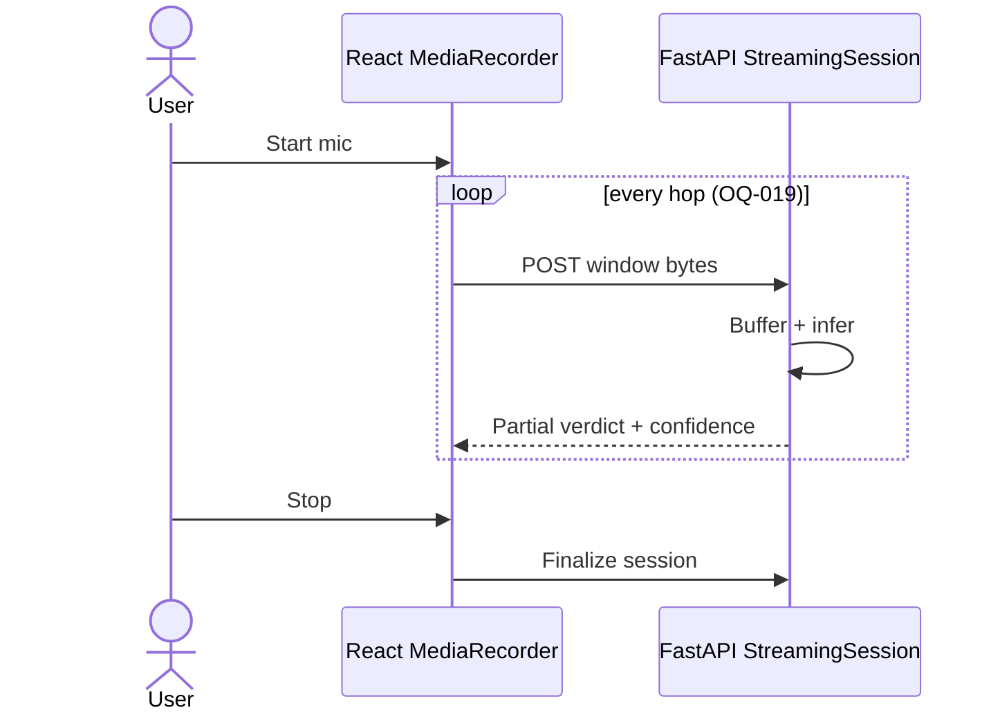
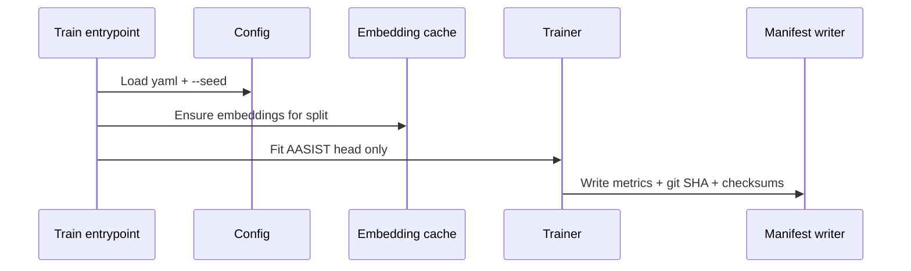
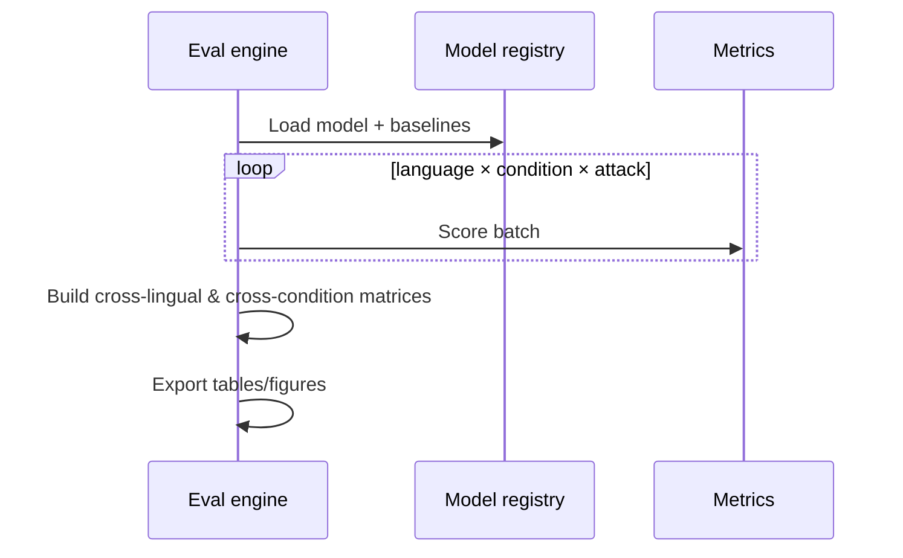
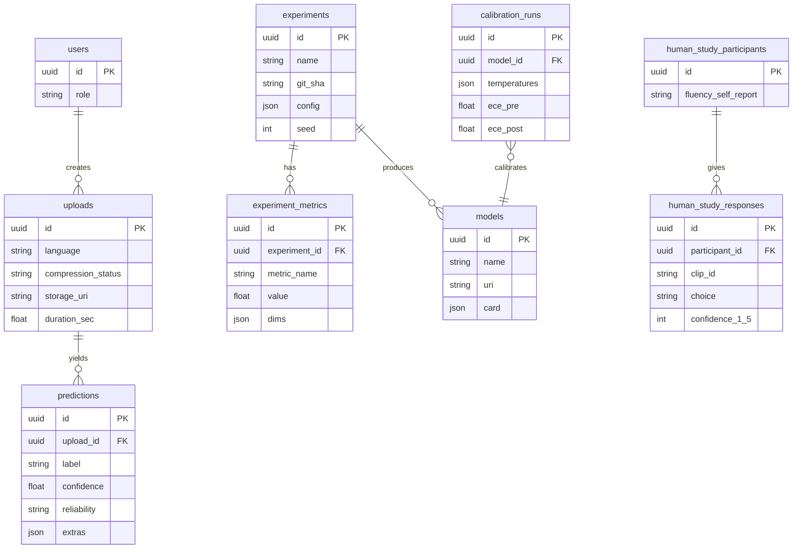
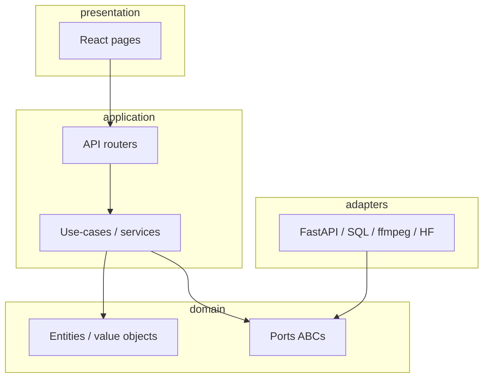

# VaaniQ — System Architecture

> Phase 0 Step 4. Cites REQ IDs. Engineering style: clean/hexagonal architecture per `vaaniq-core.mdc`.

---

## 1. C4 Level 1 — System Context



---

## 2. C4 Level 2 — Containers



**Assumption OQ-026:** Phase 1 may wire React → FastAPI directly; Node BFF lands before final demo (**REQ-092**).

---

## 3. Canonical pipeline

```mermaid
flowchart LR
  raw[Raw audio] --> val[Validation]
  val --> norm[Normalize / resample / trim]
  norm --> comp[Compression variants]
  comp --> xlsr[XLS-R embedding cached]
  xlsr --> aasist[AASIST head]
  aasist --> cal[Temperature calibration]
  cal --> xai[Explainability]
  xai --> api[API]
  api --> dash[Dashboard]
```



Maps to Proposal Fig.1 (**REQ-098**, **REQ-035–038**, **REQ-054**, **REQ-075**, **REQ-084**).

---

## 4. Sequence — single-file upload inference



Latency budget: ~≤2 s CPU (**REQ-097**) — **OQ** if XLS-R not cached at request time.

---

## 5. Sequence — real-time streaming inference



---

## 6. Sequence — training run



---

## 7. Sequence — evaluation sweep



---

## 8. ER diagram (persistence)



---

## 9. Ports (ABCs)

| Port | Responsibility | Key methods | Known implementations |
|------|----------------|-------------|------------------------|
| `AudioLoader` | Load bytes/path → waveform | `load(uri) -> Waveform` | SoundFileLoader, FallbackDecoderLoader (**REQ-094**) |
| `AudioValidator` | MIME/magic/duration/size | `validate(upload) -> None` | MagicByteValidator (**REQ-135**) |
| `Preprocessor` | Resample, trim, normalize | `transform(wav) -> Waveform` | FFmpegPreprocessor (**REQ-098**) |
| `Compressor` | Clean→Opus twin | `compress(wav, cfg) -> Waveform` | FFmpegOpusCompressor (**REQ-113**) |
| `FeatureExtractor` | XLS-R embeddings | `extract(wav) -> Embedding` | FrozenXLSRExtractor (**REQ-036**) |
| `EmbeddingCache` | Persist embeddings | `get/put(key)` | FilesystemEmbeddingCache (**REQ-037**) |
| `Classifier` | Logits / scores | `predict(emb) -> Logits` | AASISTClassifier, RawNet2, LFCCGMM (**REQ-038**, **042–043**) |
| `Calibrator` | Temperature / probs | `fit`, `transform` | TemperatureScaler (**REQ-054**) |
| `Explainer` | XAI artefacts | `explain(clip, model)` | GradCAMExplainer, BandImportanceExplainer (**REQ-075–076**) |
| `DatasetSource` | Pull/iterate corpora | `iter_clips()` | KathbathSource, … (**REQ-101–104**) |
| `Repository` | Persistence | CRUD | SqlAlchemyRepositories |
| `ObjectStore` | Blob storage | `put/get` | LocalObjectStore, S3ObjectStore |
| `ExperimentTracker` | Metrics/manifests | `log_metric`, `write_manifest` | FileExperimentTracker (**REQ-137**) |
| `HumanStudyExporter` | Export responses | `export(format)` | CsvExporter (**REQ-069**) |

---

## 10. Directory layout (target)

```text
vaaniq/
  backend/src/vaaniq/   # domain, ports, adapters, api
  frontend/            # React app
  configs/             # yaml constants (no magic numbers in src)
  scripts/             # ingest, bootstrap, gen-types
  docs/                # Phase 0 + guides
  data/                # gitignored audio
  models/              # gitignored weights
  research/            # experiments, figures, paper
  deployment/          # compose, nginx
```

Each top-level folder purpose matches Phase-1 scaffold prompt; created in Phase 1, not Phase 0.

---

## 11. Technology decisions

| Choice | Alternatives | Rationale | REQs |
|--------|--------------|-----------|------|
| Frozen XLS-R + AASIST | Train full SSL; Whisper encoder | Proposal architecture; cheap iteration on cache | REQ-036–038 |
| ffmpeg Opus | torchaudio codecs only | Proposal §11; WhatsApp-like control | REQ-113 |
| FastAPI inference | Flask, pure Node inference | Typed OpenAPI; research Python stack | REQ-092 |
| Node request layer | FastAPI-only | Proposal three-tier; swap model without FE change | REQ-092–093 |
| React + TS | Vue, plain HTML | Proposal frontend; strict FE standards | REQ-084 |
| Temperature scaling | Vector scaling, ensembles | Pascu-style; low cost | REQ-054 |
| SQLite default | Postgres-only | Laptop-friendly; PG-compatible types | OQ-021 |
| uv + Python 3.11 | conda | Environment rule | INFRA |

---

## 12. Non-functional targets

| Target | Value | Source |
|--------|-------|--------|
| Clip inference latency | ~≤2 s CPU | Proposal p.10; REQ-097 |
| AASIST head size | ~1–5M params | Proposal §5.1; REQ-040 |
| Dataset storage | ~50–80 GB | Proposal §11; REQ-111 |
| Throughput | Not stated | **OQ-020** / leave unset |
| Memory ceiling | Not stated | **OQ** — assume Colab T4 16 GB for embedding |
| Live window | Not stated | **OQ-019** default 2.0/0.5 s |

---

## 13. Component diagram (logical layers)



Domain must not import FastAPI/SQLAlchemy (`vaaniq-core.mdc`).

---

## Cross-references

- REQs: especially **REQ-036–038**, **REQ-084–096**, **REQ-092**, **REQ-113**, **REQ-135–137**
- Open questions: **OQ-007**, **OQ-013**, **OQ-016**, **OQ-019–021**, **OQ-026**
- Implementation order: `docs/PROJECT_ROADMAP.md` (**ROADMAP-001+**)
