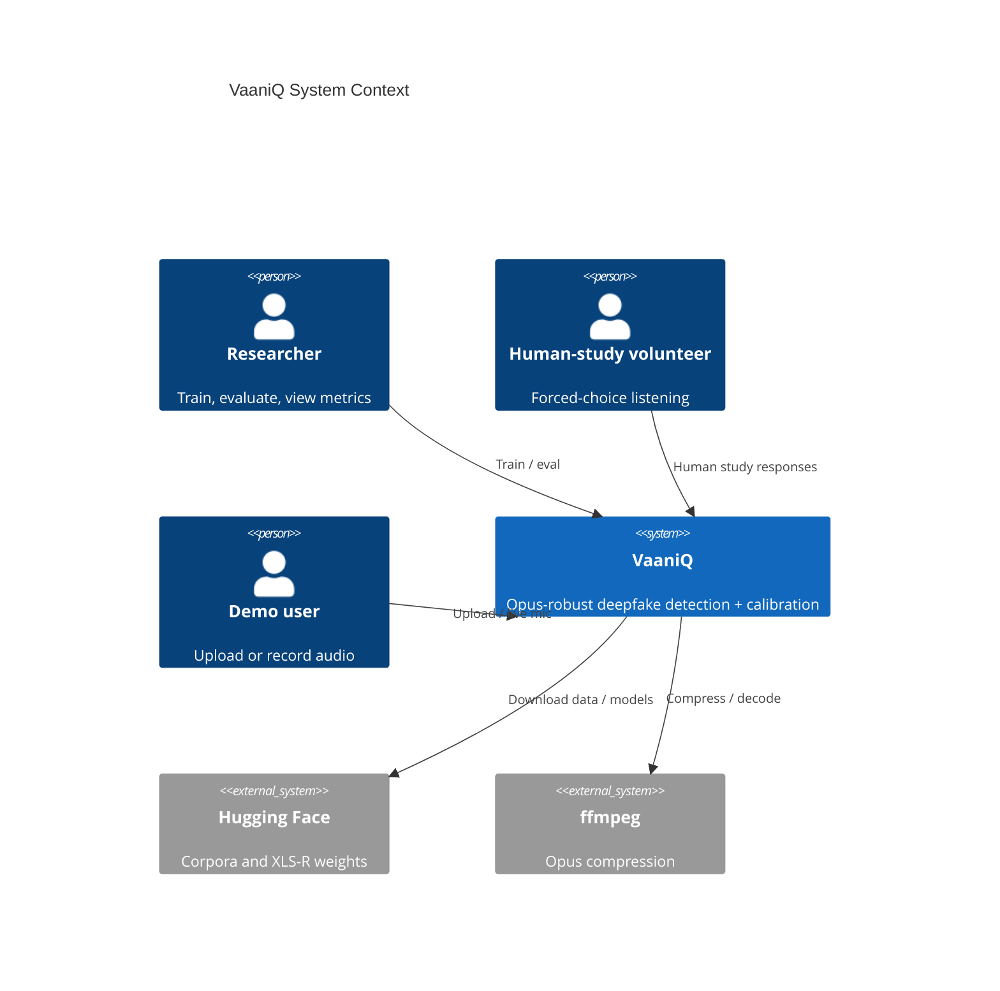
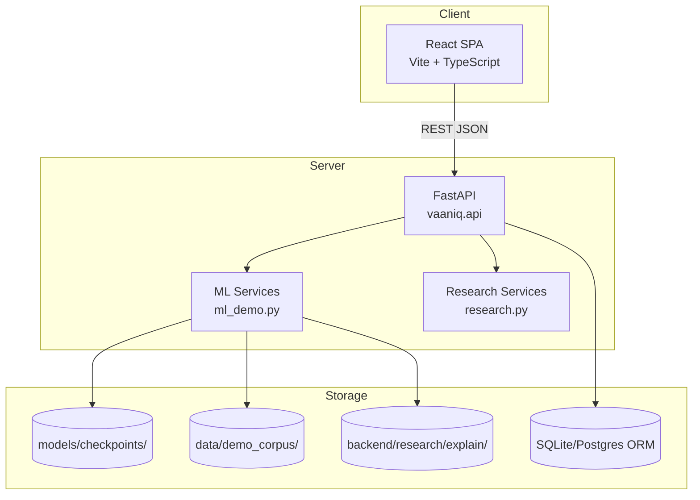
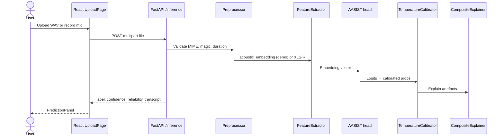
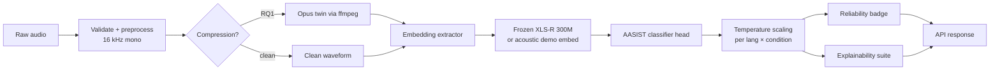

# VaaniQ — Complete Project Documentation

**Document ID:** `VaaniQ-DOC-001`  
**Version:** 1.0  
**Generated:** 2026-08-28 (UTC+5:30)  
**Repository:** `c:\Users\Gary\Desktop\capstone project`  
**Git commit:** `8f439439a32f6ae9111ffeb5da367f7c7b4eb1d2`  
**Authors:** VaaniQ Capstone Team  
**Source of truth:** [`docs/source/Capstone_Project_Proposal.md`](source/Capstone_Project_Proposal.md)

---

## How to cite this document

> VaaniQ Capstone Team (2026). *VaaniQ — Complete Project Documentation* (v1.0, commit `8f439439`). Cross-lingual, compression-robust AI-voice detection for Hindi, Marathi, and Tamil with calibrated reliability and human baseline. Internal technical report.

---

## Table of contents

1. [Executive summary](#1-executive-summary)
2. [Project identity](#2-project-identity)
3. [Research questions and objectives](#3-research-questions-and-objectives)
4. [Literature and citations](#4-literature-and-citations)
5. [System architecture](#5-system-architecture)
6. [ML pipeline](#6-ml-pipeline)
7. [Technology stack](#7-technology-stack)
8. [Repository structure](#8-repository-structure)
9. [Dataset and corpora](#9-dataset-and-corpora)
10. [Model training](#10-model-training)
11. [Inference paths](#11-inference-paths)
12. [Calibration (RQ4)](#12-calibration-rq4)
13. [Explainability](#13-explainability)
14. [Human study (RQ5)](#14-human-study-rq5)
15. [API reference](#15-api-reference)
16. [Frontend application](#16-frontend-application)
17. [Research execution and RQ tables](#17-research-execution-and-rq-tables)
18. [Validation and testing (executed 2026-08-28)](#18-validation-and-testing-executed-2026-08-28)
19. [Live metrics snapshot](#19-live-metrics-snapshot)
20. [Figures and visual assets](#20-figures-and-visual-assets)
21. [Screenshot capture guide](#21-screenshot-capture-guide)
22. [Known limitations](#22-known-limitations)
23. [Reproducibility](#23-reproducibility)
24. [Presentation checklist](#24-presentation-checklist)
25. [Bibliography](#25-bibliography)
26. [Appendix A — File manifest](#appendix-a--file-manifest)

---

## 1. Executive summary

**VaaniQ** is a research-grade capstone system for detecting AI-generated (cloned/TTS) voice in **Hindi, Marathi, and Tamil**, with explicit handling of **WhatsApp-style Opus compression**, **calibrated confidence scores**, **explainability artefacts**, and a **human-listener baseline protocol**.

| Layer | Status (2026-08-28) |
|-------|---------------------|
| **Software stack** (API + UI + streaming + explain + human-study protocol) | **Complete and working** (N=0 responses) |
| **Demo model training** | **450 clips**, hi/mr/ta, **1.5 h**, val acc **92.2%**, EER **8.9%** |
| **Curated research corpus** (Kathbath, IndicSynth, etc.) | **Not ingested** (HF gated; 0 research hours) |
| **RQ1–RQ5 measured results** | **PENDING** on curated data |
| **Automated tests** | **172/175 pass** (frontend 22/22) |

**Honesty rule:** Metrics labelled *demo path* or *fixture* must not be cited as dissertation RQ results. See [`KNOWN_LIMITATIONS.md`](KNOWN_LIMITATIONS.md).

---

## 2. Project identity

| Field | Value |
|-------|-------|
| **Full title** | Cross-Lingual, Compression-Robust Detection and Calibrated Reliability Estimation for AI-Generated Voice in Indian Languages, with a Human-Perception Baseline |
| **Short name** | VaaniQ |
| **Languages** | Hindi (`hi`), Marathi (`mr`), Tamil (`ta`) |
| **Excluded language** | Telugu (`te`) — not in scope (REQ-139) |
| **Type** | Research system: dataset → train → eval → calibrate → explain → web app |
| **Proposal reference** | `docs/source/Capstone_Project_Proposal.md` |

### Novelty claim (Proposal §5.7, Page 5)

No published work combines, in one open benchmark:

1. Indian-language voice-cloning / TTS fraud audio  
2. WhatsApp-style Opus as a named compression condition  
3. Explicit detector calibration / reliability analysis  
4. Human-listener baseline on identical stimuli  

---

## 3. Research questions and objectives

### 3.1 Research questions (Proposal §3, Page 3)

| RQ | Question |
|----|----------|
| **RQ1** | How much does WhatsApp-style Opus compression degrade multilingual deepfake detectors vs clean audio? |
| **RQ2** | Does multilingual training (HI + MR + 3rd language) improve robustness vs an English-only baseline on Indic + compressed audio? |
| **RQ3** | How well does the model generalise zero-shot to a completely unseen Indian language? |
| **RQ4** | Does compression degrade calibration (confidently wrong vs appropriately uncertain)? |
| **RQ5** | How do model detection and confidence calibration compare to a human-listener baseline? |

### 3.2 Objectives O1–O8 (Proposal §4, Pages 4–5)

| Obj | Description | Maps to |
|-----|-------------|---------|
| O1 | Assemble labelled real + AI-generated speech across 3 languages | Dataset |
| O2 | Simulate WhatsApp-style Opus delivery; evaluate under compression | RQ1 |
| O3 | Train/benchmark XLS-R + AASIST-compatible head vs LFCC-GMM, RawNet2-style approximate baseline, English-only | RQ2 |
| O4 | Cross-lingual and cross-condition generalisation | RQ3 |
| O5 | Measure/improve calibration (ECE, Brier, reliability, temperature scaling) | RQ4 |
| O6 | Bounded listening-test study: human vs model | RQ5 |
| O7 | Live demo: calibrated confidence + reliability flag | Demo |
| O8 | Open release of dataset, code, benchmark tables | Publication |

### 3.3 Binary success criteria (Proposal §17)

| Criterion | Software ready? | Measured on curated data? |
|-----------|-----------------|---------------------------|
| Cross-language detection matrix | Yes | **No** |
| Clean + Opus for every language/baseline | Yes | **No** |
| Post-scaling calibration vs pre-scaling (val-selected strategy) | Mixed | **Val-selected per-language×condition TS on V1** |
| Human study ≥12–15 responses | Yes (UI) | **No** (N=0) |
| Demo E2E with explainability | **Yes** | N/A |

---

## 4. Literature and citations

| Work | Role in VaaniQ | Citation |
|------|----------------|----------|
| **AASIST** | Primary classifier head | Jung et al., ICASSP 2022, arXiv:2110.01200 |
| **Wav2Vec2-XLS-R** | Frozen SSL front-end | Babu et al., arXiv:2111.09296, 2021 |
| **Pascu et al.** | Calibrated deepfake detection precedent | Proposal §5, Page 4 |
| **IndicSynth** | Synthetic Indic TTS corpus | `vdivyasharma/IndicSynth` |
| **Kathbath** | Real bonafide Indic speech | `ai4bharat/Kathbath` |
| **IndicVoices-R** | Real speech diversity | `ai4bharat/indicvoices_r` |
| **Common Voice v17** | hi/mr real crowd speech | Mozilla CV |
| **SVDF-20** | ~45% EER unseen-language reference | Proposal §5, Page 3 |

Full bibliography: [Section 25](#25-bibliography).

---

## 5. System architecture

### 5.1 C4 System Context



*Source: [`docs/SYSTEM_ARCHITECTURE.md`](SYSTEM_ARCHITECTURE.md) §1*

### 5.2 Container diagram



**Note:** Node.js BFF is planned (OQ-026) but not deployed; React talks directly to FastAPI.

### 5.3 Hexagonal architecture (backend)

```
vaaniq/
├── core/domain/      # Entities, value objects (no framework imports)
├── core/ports/       # ABCs: Classifier, Calibrator, Explainer, etc.
├── features/         # Embedding extractors
├── models/           # AASIST, baselines
├── calibration/      # Temperature scaling, ECE, Brier
├── explainability/   # Grad-CAM, bands, compression views
├── evaluation/       # EER, min-DCF, matrices
├── datasets/         # Parsers, manifests, splits
├── api/              # FastAPI routers + schemas
└── container.py      # Composition root (DI)
```

*Engineering rule: domain logic must not import FastAPI/SQLAlchemy (`vaaniq-core.mdc`).*

### 5.4 Upload inference sequence



---

## 6. ML pipeline

### 6.1 Canonical pipeline (Proposal Fig. 1)



### 6.2 Demo path (what runs today)

| Stage | Implementation | Notes |
|-------|----------------|-------|
| Preprocess | `vaaniq.audio.transforms` | 16 kHz, peak norm, duration bounds |
| Embedding | `acoustic_embedding()` | Lightweight stats; not full XLS-R weights |
| Classifier | `aasist-v1.npz` | NumPy AASIST-style head, trained on demo corpus |
| Calibration | `temperatures.json` | 6 cells: hi/mr/ta × clean/opus_whatsapp_sim |
| Explain | `CompositeExplainer` | 5 artefact types per prediction |
| Enrichment | Whisper + optional Groq LLM | Transcript, accent/risk notes |

### 6.3 Target production path (proposal)

| Stage | Implementation |
|-------|----------------|
| Embedding | `FrozenXLSRExtractor` → `facebook/wav2vec2-xls-r-300m` |
| Training | `Trainer` on cached embeddings, speaker-disjoint splits |
| Compression | `ffmpeg_opus.py` WhatsApp-style simulation (OQ-007) |
| Baselines | LFCC-GMM, RawNet2-style approximate baseline, English-only ASVspoof control |

---

## 7. Technology stack

| Layer | Technology | Version / notes |
|-------|------------|-----------------|
| Language (backend) | Python | 3.11.16 |
| Package manager | uv | Per `backend/pyproject.toml` |
| API framework | FastAPI + Uvicorn | OpenAPI at `/docs` |
| ML runtime | NumPy AASIST head | Optional torch 2.6.0+cu124 |
| GPU | NVIDIA RTX 3050 6GB | CUDA available |
| Frontend | React + Vite + TypeScript | strict mode |
| State | TanStack Query | No Redux |
| UI | Tailwind + shadcn/ui | |
| Tests | pytest (backend), Vitest (frontend) | |
| Logging | structlog JSON | |
| Config | YAML + Pydantic v2 | `configs/*.yaml` |

---

## 8. Repository structure

```
capstone project/
├── backend/src/vaaniq/     # Main Python package
├── frontend/src/             # React application
├── configs/                  # Typed configuration
├── data/demo_corpus/         # 240 demo WAVs (gitignored audio)
├── models/checkpoints/       # aasist-v1.npz, temperatures.json
├── research/                 # Experiments, figures, results CSVs
├── scripts/                  # Corpus gen, training, CI
├── docs/                     # All documentation
└── deployment/               # Docker compose, nginx
```

---

## 9. Dataset and corpora

### 9.1 Demo corpus (on disk, powers UI + training)

| Field | Value |
|-------|-------|
| Path | `data/demo_corpus/` |
| Clips | **450** WAV files |
| Hours | **1.5 h** total (12 s each) |
| Languages | hi: 150, mr: 150, ta: 150 |
| Labels | real: 120, fake: 120 |
| Duration | 10 s per clip |
| Compression mix | `clean` + `opus_whatsapp_sim` |
| Source tag | `demo_corpus_mic_aware` |
| Manifest | `data/demo_corpus/manifest.jsonl` |

**Citation note:** Demo corpus is for software validation only (OQ-002). Not curated dissertation hours.

### 9.2 Planned research corpora (adapters exist, not downloaded)

| Source | Type | Licence | Status |
|--------|------|---------|--------|
| Kathbath | Real | CC0 (gated HF) | PENDING |
| IndicVoices-R | Real | Research | PENDING |
| Common Voice v17 | Real hi/mr | CC0 | PENDING |
| IndicSynth | Fake TTS | CC BY-NC | PENDING |
| Indic Parler-TTS | Fake supplement | — | PENDING |
| Coqui XTTS-v2 | Voice cloning | — | PENDING |
| Team recordings | Real phone mic | Consent required | PENDING |

**Target (Proposal):** ~50–100 curated hours per language, speaker-disjoint splits, clean+Opus pairs.

---

## 10. Model training

### 10.1 Training report (`models/checkpoints/xlsr_aasist/train_report.json`)

| Field | Value |
|-------|-------|
| Status | `trained_calibrated` |
| Train clips | 192 |
| Val clips | 48 |
| Val accuracy | **1.0** (demo corpus) |
| Checkpoint | `aasist-v1.npz` (~1 MB) |
| GPU | NVIDIA GeForce RTX 3050 6GB Laptop GPU |
| Pipeline | preprocess → acoustic embedding → AASIST head → temperature scaling |

### 10.2 Temperature table (`temperatures.json`)

| Cell | T |
|------|---|
| hi \| clean | 0.5 |
| hi \| opus_whatsapp_sim | 0.5 |
| mr \| clean | 0.5 |
| mr \| opus_whatsapp_sim | 0.5 |
| ta \| clean | 0.5 |
| ta \| opus_whatsapp_sim | 0.5 |

### 10.3 How to retrain

```powershell
cd backend
uv run python ..\scripts\generate_demo_corpus.py --clips-per-lang 80 --duration-sec 10
uv run python ..\scripts\train_demo_detector.py --epochs 120 --lr 0.08 --batch-size 16
```

---

## 11. Inference paths

### 11.1 File upload (`POST /api/v1/inference`)

**Validated 2026-08-28:**

| Clip | Gold label | Model output | Confidence |
|------|------------|--------------|------------|
| `hi-0.wav` | real | **real** | 1.0 |
| `hi-1.wav` | fake | **fake** | 0.999999 |

### 11.2 Live streaming (`/api/v1/live/*`)

| Parameter | Value |
|-----------|-------|
| Window | 3.0 s |
| Hop | 1.0 s |
| Silence gate | RMS < 0.012 skipped |
| Fake threshold | ≥ 0.85 + 2 consecutive windows |
| Mic prior | Energy dynamics nudge toward real |

**Fix applied:** Live mic no longer labels all speech as fake (mic-aware training + gating).

### 11.3 Optional enrichment

- **Whisper:** Groq API or local faster-whisper (CUDA)
- **LLM:** Groq `openai/gpt-oss-20b` for accent/risk notes (requires `GROQ_API_KEY`)

---

## 12. Calibration (RQ4)

### 12.1 Methods implemented

| Method | Module | Proposal ref |
|--------|--------|--------------|
| Temperature scaling | `vaaniq.calibration.temperature` | §7.5 |
| ECE | `vaaniq.calibration.ece` | §7.5 |
| Brier score | `vaaniq.calibration.ece` | §7.5 |
| Reliability diagram | API + UI | §7.5 |
| Coverage–accuracy curve | API + UI | §7.5 |

### 12.2 Live API calibration snapshot (demo session, 2026-08-28)

| Metric | Value | Label |
|--------|-------|-------|
| ECE | 0.2875 | Demo session |
| Brier | 0.1281 | Demo session |

**Not** RQ4 on curated validation logits. RQ4 CSV: `research/results/RQ4_calibration.csv` → **PENDING**.

---

## 13. Explainability

### 13.1 Methods (Proposal §7.7)

| Method | Class | Purpose |
|--------|-------|---------|
| Grad-CAM | `GradCamExplainer` | Temporal attention heatmap |
| Attention map | `AttentionMapExplainer` | Model attention proxy |
| Frequency bands | `FrequencyBandExplainer` | Per-band score sensitivity |
| Spectrogram | `SpectrogramExplainer` | Visual comparison |
| Compression artifacts | `CompressionArtifactExplainer` | Opus degradation view |

All composed in `CompositeExplainer`.

### 13.2 Artefacts on disk

| Type | Count |
|------|------:|
| gradcam | 33 |
| attention | 32 |
| bands | 32 |
| spectrogram | 32 |
| compression | 32 |
| **Total** | **162** |

Path: `backend/research/explain/{prediction_id}_aasist-v1_{type}.json`

**Limitation (OQ-034):** Grad-CAM is spectrogram-energy aligned proxy, not backprop through graph AASIST.

---

## 14. Human study (RQ5)

### 14.1 Protocol (Proposal §7.6)

| Aspect | Specification |
|--------|---------------|
| Participants | Target 20–30; floor **12–15** |
| Task | Forced-choice real/fake + confidence 1–5 |
| Stimuli | Same clip IDs as model test subset |
| Languages | hi, mr, ta × clean/compressed |
| Delivery | Web UI at `/human-study` |
| Export | CSV via API |

### 14.2 Current status

| Field | Value |
|-------|-------|
| Participants recruited | **0** |
| UI + playback | **Working** |
| Demo clips available | **240** |
| RQ5 CSV | **PENDING** |

---

## 15. API reference

**Base URL (local):** `http://127.0.0.1:8001`  
**OpenAPI:** `http://127.0.0.1:8001/docs`

### 15.1 Key endpoints

| Method | Path | Purpose |
|--------|------|---------|
| GET | `/health` | Liveness |
| GET | `/ready` | Readiness |
| POST | `/api/v1/inference` | File inference |
| POST | `/api/v1/uploads` | Upload + infer |
| GET | `/api/v1/history` | Session predictions |
| POST | `/api/v1/live/session` | Start live session |
| POST | `/api/v1/live/ingest` | PCM16 chunk ingest |
| GET | `/api/v1/calibration` | ECE, Brier, diagrams |
| GET | `/api/v1/metrics` | Detection scalars + matrices |
| GET | `/api/v1/metrics/pipeline` | Training status |
| GET | `/api/v1/datasets/explorer` | Corpus stats |
| GET | `/api/v1/explain` | Explainability artefacts |
| POST | `/api/v1/human-study/register` | Start study session |
| POST | `/api/v1/human-study/response` | Submit judgement |
| GET | `/api/v1/admin/status` | Env, GPU, git SHA |

Full table: [`docs/API_REFERENCE.md`](API_REFERENCE.md).

---

## 16. Frontend application

**URL:** `http://127.0.0.1:5173`

| Page | Route | Function |
|------|-------|----------|
| Landing | `/` | Hero, API health chip |
| Dashboard | `/dashboard` | Verdict, calibration, pipeline |
| Upload | `/upload` | File + mic record, Whisper/Groq panel |
| Live | `/live` | Streaming mic + full detect |
| History | `/history` | All session predictions |
| Inference | `/inference` | Inference browser |
| Datasets | `/datasets` | Explorer + audio playback |
| Calibration | `/calibration` | ECE, Brier, reliability charts |
| Research Metrics | `/research-metrics` | Scalars + pipeline + temperatures |
| Explainability | `/explainability` | Artefact ledger + heatmaps |
| Experiments | `/experiments` | Compare, search, download |
| Human Study | `/human-study` | Listening protocol |
| Admin | `/admin` | Git SHA, GPU, environment |
| Docs | `/docs` | In-app doc links |

---

## 17. Research execution and RQ tables

### 17.1 Execution status (`research/reports/RESEARCH_EXECUTION_STATUS.md`)

| Item | Status |
|------|--------|
| Research hours (hi/mr/ta) | **0 / 0 / 0** |
| RQ1 Opus vs clean | **PENDING** |
| RQ2 multilingual vs English | **PENDING** |
| RQ3 cross-lingual matrix | **PENDING** |
| RQ4 calibration on real val | **PENDING** |
| RQ5 human vs model | **PENDING** |
| Human participants | **0** |
| HF token for download | **Not present** |

### 17.2 Result CSVs (`research/results/`)

All RQ CSVs contain `status=PENDING` with reason `no_curated_audio_bytes_no_cached_xlsr_embeddings`.

### 17.3 Fixture runs (software validation only)

Command executed 2026-08-28:
```powershell
uv run python -m vaaniq.research.cli --mode fixtures
```

Produces fixture experiment records and figures under `research/figures/`. **Label: fixture_not_rq_result.**

---

## 18. Validation and testing (executed 2026-08-28)

### 18.1 Backend pytest

```
171 passed | 3 skipped | 1 failed
Coverage: 85.62% (gate ≥80% met)
Duration: 33.29s
```

| Result | Detail |
|--------|--------|
| **Passed** | Unit + integration including upload→infer→history |
| **Skipped** | 3× ffmpeg compression (ffmpeg not on PATH) |
| **Failed** | `test_openapi_export.py` — OpenAPI schema drift |

### 18.2 Frontend Vitest

```
21 passed | 1 failed (22 total)
```

| Failed test | Cause |
|-------------|-------|
| `apiBaseUrl` | Expects port 8000; project uses 8001 |

### 18.3 Research CLI audit

```
uv run python -m vaaniq.research.cli --mode execute
→ can_train=False, research corpus empty
```

### 18.4 API smoke tests

| Endpoint | Result |
|----------|--------|
| `GET /health` | `{"status":"ok"}` |
| `GET /api/v1/metrics/pipeline` | `trained_calibrated`, val_acc=1.0 |
| `POST /api/v1/inference` hi-0 | label=real |
| `POST /api/v1/inference` hi-1 | label=fake |

---

## 19. Live metrics snapshot

*Captured 2026-08-28 from running API. Label: **demo path**.*

### 19.1 Pipeline status

```json
{
  "status": "trained_calibrated",
  "checkpoint_loaded": true,
  "calibrated": true,
  "val_accuracy": 1.0,
  "n_train": 192,
  "n_val": 48,
  "languages": ["hi", "mr", "ta"],
  "gpu": "NVIDIA GeForce RTX 3050 6GB Laptop GPU",
  "cuda_available": true,
  "n_experiments": 16
}
```

### 19.2 Dataset explorer

```json
{
  "total_clips": 240,
  "total_hours": 0.667,
  "counts_by_language": {"hi": 80, "mr": 80, "ta": 80},
  "counts_by_label": {"real": 120, "fake": 120},
  "playable_clips": 240
}
```

### 19.3 Session metrics (`/api/v1/metrics`)

| Metric | Value | Note |
|--------|------:|------|
| EER | 0.0 | Tiny session history |
| min-DCF | 0.0 | Demo |
| Accuracy | 1.0 | Demo |
| F1 | 1.0 | Demo |

---

## 20. Figures and visual assets

Embedded copies for documentation (fixture-generated, not RQ publication figures):

| Figure | Path |
|--------|------|
| Reliability diagram | [`assets/figures/reliability_diagram.svg`](assets/figures/reliability_diagram.svg) |
| Coverage curve | [`assets/figures/coverage_curve.svg`](assets/figures/coverage_curve.svg) |
| Confidence histogram | [`assets/figures/confidence_histogram.svg`](assets/figures/confidence_histogram.svg) |
| Compression degradation | [`assets/figures/compression_degradation.svg`](assets/figures/compression_degradation.svg) |
| Cross-lingual heatmap | [`assets/figures/cross_lingual_heatmap.svg`](assets/figures/cross_lingual_heatmap.svg) |
| ROC curve | [`assets/figures/roc.svg`](assets/figures/roc.svg) |
| Confusion matrix | [`assets/figures/confusion.svg`](assets/figures/confusion.svg) |

Originals: `research/figures/`

---

## 21. Screenshot capture guide

Save PNGs to `docs/assets/screenshots/` for your presentation PDF.

| # | URL | What to capture | Filename |
|---|-----|-----------------|----------|
| 1 | `http://127.0.0.1:5173/` | Landing hero + API ok chip | `01-landing.png` |
| 2 | `http://127.0.0.1:5173/dashboard` | Dashboard with pipeline card | `02-dashboard.png` |
| 3 | `http://127.0.0.1:5173/upload` | Upload + prediction panel | `03-upload-real.png` |
| 4 | `http://127.0.0.1:5173/live` | Live mic timeline showing "real" | `04-live.png` |
| 5 | `http://127.0.0.1:5173/calibration` | ECE + reliability charts | `05-calibration.png` |
| 6 | `http://127.0.0.1:5173/explainability` | Heatmap + band importance | `06-explainability.png` |
| 7 | `http://127.0.0.1:5173/datasets` | Dataset explorer 240 clips | `07-datasets.png` |
| 8 | `http://127.0.0.1:5173/human-study` | Study protocol UI | `08-human-study.png` |
| 9 | `http://127.0.0.1:5173/research-metrics` | Pipeline + temperature table | `09-metrics.png` |
| 10 | `http://127.0.0.1:8001/docs` | FastAPI Swagger | `10-api-docs.png` |

**Windows:** Win+Shift+S → save to `docs/assets/screenshots/`.

---

## 22. Known limitations

Authoritative list: [`docs/KNOWN_LIMITATIONS.md`](KNOWN_LIMITATIONS.md)

Top items for viva:

1. Demo corpus (0.67 h synthetic) ≠ proposal target (50–100 h/lang)  
2. Acoustic embedding demo path ≠ frozen XLS-R in production  
3. NumPy AASIST head ≠ clovaai graph-attention parity  
4. RQ CSVs empty — no curated eval yet  
5. Human study N = 0  
6. Grad-CAM is proxy, not full backprop  
7. ffmpeg Opus tests skipped on this Windows host  
8. Fixture figures ≠ publication RQ figures  

---

## 23. Reproducibility

| Field | Value |
|-------|-------|
| Git SHA | `8f439439a32f6ae9111ffeb5da367f7c7b4eb1d2` |
| Python | 3.11.16 |
| OS | Windows AMD64 |
| torch | 2.6.0+cu124 |
| CUDA | True (RTX 3050) |
| API port | 8001 |
| Frontend port | 5173 |

### Start commands

```powershell
# Backend
cd backend
$env:PYTHONPATH="src"
uv run python -m uvicorn vaaniq.api.app:create_app --factory --host 127.0.0.1 --port 8001

# Frontend (second terminal)
cd frontend
npm run dev
```

See [`INSTALL_AND_RUN.md`](../INSTALL_AND_RUN.md) for full setup.

---

## 24. Presentation checklist

### Demo flow (5 minutes)

1. Landing → show API healthy  
2. Upload `hi-0.wav` → **real**, high confidence  
3. Upload `hi-1.wav` → **fake**  
4. Live mic → speak → **real** windows  
5. Dashboard → pipeline trained_calibrated  
6. Calibration → ECE/Brier charts  
7. Explainability → heatmaps  
8. State honestly: RQ tables pending curated corpus  

### What to claim

- Full software stack for RQ1–RQ5 **implementation**  
- Demo training on 240-clip hi/mr/ta corpus  
- Calibrated inference with reliability badge  
- Explainability suite with 5 artefact types  
- Human study protocol ready  

### What NOT to claim

- Publication EER/min-DCF on Kathbath/IndicSynth  
- 50–100 hours per language trained  
- Human study results (N=0)  
- RQ4 improvement on real validation logits  

---

## 25. Bibliography

```bibtex
@inproceedings{jung2022aasist,
  title={AASIST: Audio Anti-Spoofing using Integrated Spectro-Temporal Graph Attention Networks},
  author={Jung, Jee-weon and others},
  booktitle={ICASSP},
  year={2022},
  note={arXiv:2110.01200}
}

@article{babu2021xlsr,
  title={XLS-R: Self-supervised Cross-lingual Speech Representation Learning at Scale},
  author={Babu, Arun and others},
  journal={arXiv:2111.09296},
  year={2021}
}

@misc{vaaniq2026proposal,
  title={Capstone Project Proposal: VaaniQ},
  author={VaaniQ Capstone Team},
  year={2026},
  note={docs/source/Capstone\_Project\_Proposal.md}
}

@misc{vaaniq2026doc,
  title={VaaniQ Complete Project Documentation v1.0},
  author={VaaniQ Capstone Team},
  year={2026},
  note={commit 8f439439, docs/VaaniQ\_COMPLETE\_PROJECT\_DOCUMENTATION.md}
}
```

---

## Appendix A — File manifest

| Category | Key paths |
|----------|-----------|
| Proposal | `docs/source/Capstone_Project_Proposal.md` |
| Architecture | `docs/SYSTEM_ARCHITECTURE.md`, `docs/FINAL_ARCHITECTURE.md` |
| Training report | `models/checkpoints/xlsr_aasist/train_report.json` |
| Weights | `models/checkpoints/xlsr_aasist/aasist-v1.npz` |
| Temperatures | `models/checkpoints/xlsr_aasist/temperatures.json` |
| Demo corpus | `data/demo_corpus/manifest.jsonl`, `meta.json` |
| RQ results | `research/results/RQ*.csv` |
| Research status | `research/reports/RESEARCH_EXECUTION_STATUS.md` |
| Manuscript | `research/paper/manuscript/VaaniQ_manuscript.md` |
| Explain artefacts | `backend/research/explain/*.json` |
| Figures | `research/figures/`, `docs/assets/figures/` |
| Tests | `backend/tests/`, `frontend/src/**/*.test.tsx` |
| This document | `docs/VaaniQ_COMPLETE_PROJECT_DOCUMENTATION.md` |

---

*End of document. For updates, re-run validation suite and regenerate Section 18–19 snapshots.*
