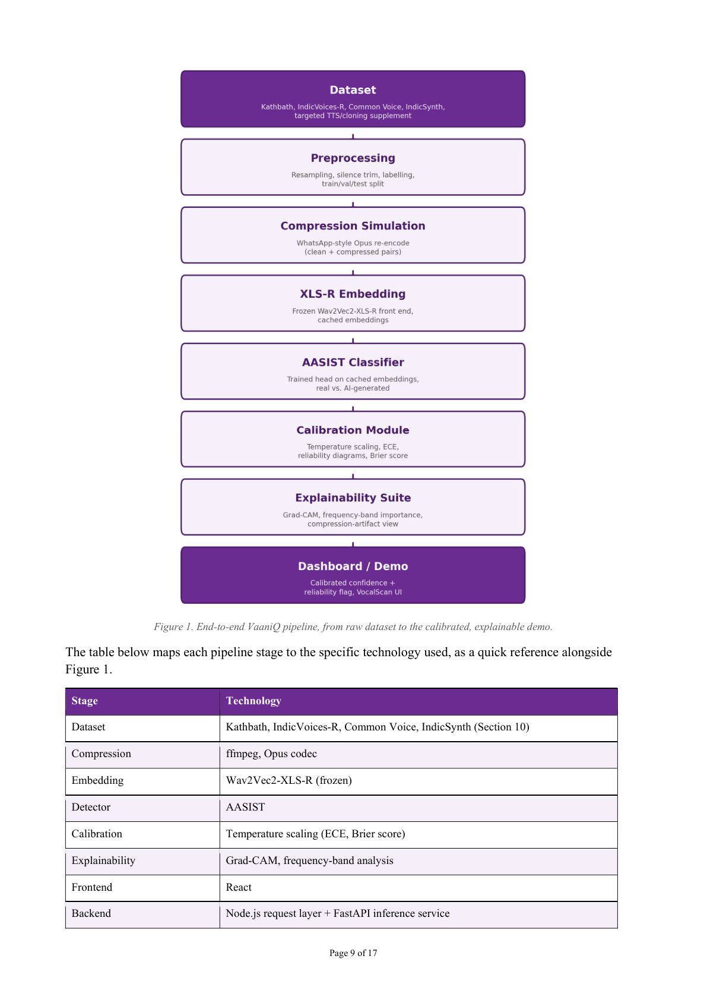
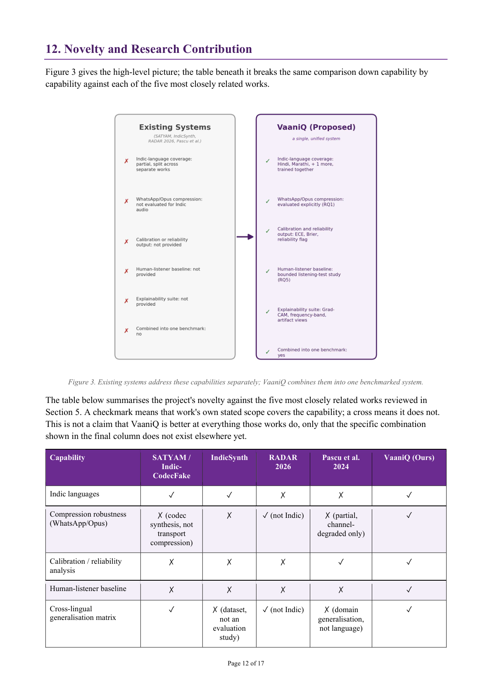
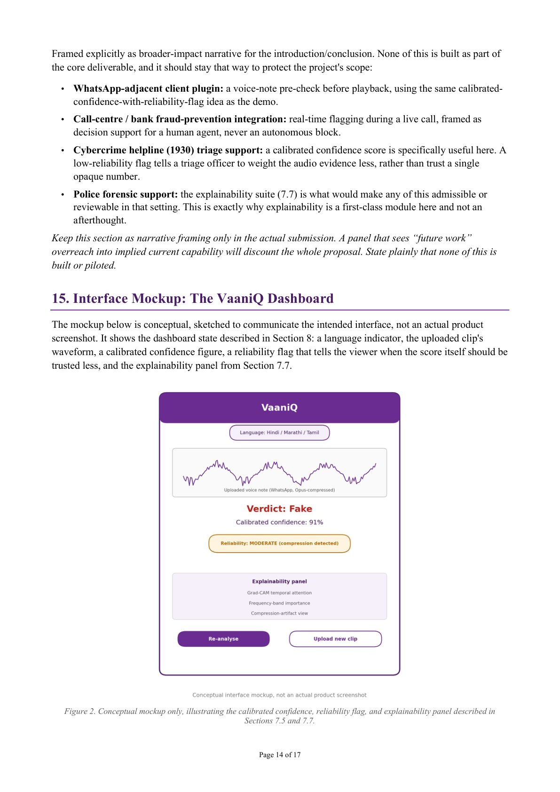

# Source extract: `Capstone_Project_Proposal_260806_145819.pdf`

- Ingested: `2026-08-06T09:36:25.749697+00:00`
- Source path: `c:\Users\Aarav Phutane\Downloads\Capstone_Project_Proposal_260806_145819.pdf`
- Page/slide count: 17

---

<!-- page: 1 -->

## Page 1

CAPSTONE PROJECT PROPOSAL 
VaaniQ 
Cross-Lingual, Compression-Robust Detection and Calibrated Reliability 
Estimation for AI-Generated Voice in Indian Languages, with a Human-Perception 
Baseline 
A cross-lingual audio deepfake detection system for Indian languages that reports not just a verdict, but a 
calibrated, trustworthy confidence in that verdict. 
Domain: Artificial Intelligence and Machine Learning. Deep Learning, NLP and Audio Signal Processing (ANN, 
CNN, Self-Supervised Speech Models, Uncertainty Estimation) 
NMIMS, Mukesh Patel School of Technology Management & Engineering (MPSTME) 
Submitted by (Team of 4): 
Gaurav Phadale, SAP ID: 70022300092 
Eshaan Sarkhawas, SAP ID: 70022300066 
Aarav Phutane, SAP ID: 70022300152 
Prajwal Patil, SAP ID: 70022300213 
Guided by: Prof. Rama Bharti Varshney 
Academic Year 2026–27

<!-- page: 2 -->

## Page 2

Page 2 of 17 
1. Executive Summary 
AI voice cloning is an active, documented fraud method in India. A 2023 McAfee survey found 47% of 
Indian adults had experienced or knew someone who experienced an AI voice scam, and a real, press-
reported Powai (Mumbai) case cost a victim ₹80,000 in April 2024. These scams arrive as compressed 
WhatsApp voice notes, in Hindi, Marathi, and other Indian languages that almost no published detector is 
trained or tested on. 
Most capstone projects in this space stop at asking whether the system can detect fake audio at all. A single 
detection benchmark, however well executed, addresses only part of what a research-oriented capstone is 
expected to contribute. VaaniQ is built around three linked contributions instead of one: 
• Detection: a cross-lingual, compression-robust benchmark for Indian-language voice-cloning fraud 
audio. Section 5.7 establishes this gap precisely against the closest existing work (SATYAM/Indic-
CodecFake, IndicSynth, RADAR 2026). 
• Calibrated reliability: the system reports not just a raw score, but a trustworthy confidence, and 
explicitly flags when compression has degraded the signal enough that its own judgement should be 
doubted. This is measured, not asserted (Expected Calibration Error, reliability diagrams, Brier score, 
temperature scaling), building on real prior work in calibrated speech-deepfake detection (Pascu et al., 
Interspeech 2024) that has not yet been studied for Indian languages or WhatsApp-style compression 
specifically. 
• Human baseline: a small listening-test study answers a question no Indic-language deepfake paper 
currently answers: how do Hindi/Marathi listeners' own ears compare to the model, and does that gap 
shrink or widen once compression is applied? 
This is a scoped, achievable project built end to end by the team: a three-tier application (Section 7.9) sitting 
on top of the pipeline summarised in Section 8, using the compute and tooling plan set out in Section 11, with 
every dataset and model listed against its exact, independently-verified repository path in Section 10. The 
calibration and human-baseline modules are deliberately lightweight additions on top of infrastructure the 
project already needs: calibration is arithmetic on predictions the model already produces, and the human 
study is a bounded, one-time listening test rather than new modelling work. Instead of a single number (EER), 
the dissertation answers five explicit research questions (Section 4), each with its own results table, giving the 
project a complete and coherent research narrative. 
2. Introduction and Motivation 
2.1 The problem and its documented scale 
“Deepfake audio” is speech generated or altered by AI to sound like a real person without their involvement. 
Modern voice-cloning tools need only a few seconds of reference audio. This is an active fraud vector in 
India: 
• McAfee's “The Artificial Imposter” report (May 2023, n=7,054 across 7 countries) found 47% of 
Indian adults had experienced or knew someone who experienced an AI voice scam, nearly double the 
25% global average, and 69% of Indian respondents could not confidently distinguish a cloned voice 
from a real one. 
• A real, press-reported case: a 68-year-old Powai (Mumbai) businessman, Vinod Kumar Kachhara, was 
defrauded of ₹80,000 in April 2024 after a caller played a cloned recording of his son's voice claiming a 
fabricated “arrest” abroad (Hindustan Times / Mumbai Police). 
• These calls are near-universally delivered over WhatsApp voice notes or VoIP calls, and both apply 
lossy Opus compression before the audio reaches a victim, or a detector.

<!-- page: 3 -->

## Page 3

Page 3 of 17 
Sourcing note: an early draft cited a “2,300 cases, 450% increase” Haryana statistic and rupee-figure 
anecdotes that traced to a single SEO blog and a non-journalistic wiki respectively, with no identifiable 
primary source. Both are excluded here; everything above traces to a named, dated, checkable source. 
2.2 Why existing detectors don't transfer 
Two gaps compound. Language: almost every major benchmark (ASVspoof, CtrSVDD, SVDD 2024) is 
built on English/Mandarin; narrow-language training degrades toward ~45% EER on unfamiliar languages 
(SVDF-20 benchmark). Compression: the RADAR Challenge 2026 (arXiv:2605.09568) confirms detectors 
lose significant accuracy under codec compression, but its multilingual set covers English, Singapore English, 
Mandarin, Taiwanese Mandarin, Japanese, and Vietnamese only. No Indian language appears in RADAR 
2026's evaluation set. A third, quieter gap sits underneath both. Even where detectors still work, nobody has 
checked whether their confidence scores can be trusted once language and compression conditions shift 
away from training conditions, which is precisely when a wrong, overconfident answer is most dangerous in a 
real fraud-triage setting. 
3. Problem Statement 
To design, build, and evaluate a deep-learning system that (a) reliably distinguishes real from AI-generated 
speech in Hindi, Marathi, and one additional Indian language under WhatsApp-style Opus compression, (b) 
reports a calibrated, trustworthy confidence rather than a raw, potentially overconfident score, and (c) is 
benchmarked not only against established ML baselines but against a human-listener baseline. The goal is to 
answer not just “can a model detect this” but “how much can its answer be trusted, and how does that 
compare to a person's own ears.” 
4. Research Questions 
Every later section (methodology, evaluation, results) maps back to one of these five questions. This is what 
gives the dissertation a spine instead of a list of numbers. 
• RQ1: How much does WhatsApp-style Opus compression degrade multilingual deepfake detectors, 
relative to clean audio? 
• RQ2: Does multilingual training (Hindi + Marathi + a 3rd language) improve robustness relative to an 
English-only-trained baseline, on Indian-language and compressed audio? 
• RQ3: How well does the model generalise to a completely unseen Indian language (zero-shot cross-
lingual transfer)? 
• RQ4: Does compression degrade not just accuracy but calibration, meaning does the model become 
confidently wrong rather than appropriately uncertain as conditions worsen? 
• RQ5: How does the model's detection and confidence-calibration performance compare to a human-
listener baseline, across languages and compression conditions? 
5. Literature Review and Research Gap 
5.1 Foundational architectures 
• AASIST (Jung et al., ICASSP 2022, arXiv:2110.01200), a standard lightweight anti-spoofing 
architecture (~1–5M parameters). Official repo bundles RawNet2 and ASVspoof EER/t-DCF code 
(Section 10). 
• Wav2Vec2-XLS-R (Babu et al., arXiv:2111.09296, 2021), a self-supervised speech model, 128 
languages, ~436,000 hours pretraining. Used frozen as a front-end.

<!-- page: 4 -->

## Page 4

Page 4 of 17 
5.2 Singing-voice and multilingual deepfake benchmarks 
• CtrSVDD / SVDD 2024 (Zang et al.; Zhang et al., IEEE SLT 2024), leading singing-voice deepfake 
benchmarks, built almost entirely on English/Mandarin. 
• SVDF-20 (OpenReview, submitted ICLR 2026, later withdrawn per OpenReview modification log 14 
Dec 2025; cite as preprint). First multilingual singing-deepfake benchmark including all 10 major Indic 
languages; narrow-language training degrades to ~45% EER on unseen languages. 
5.3 Robustness to real-world audio transformations 
• RADAR Challenge 2026 (Luong et al., APSIPA Grand Challenge, arXiv:2605.09568) evaluates 
detectors under codec compression, resampling, noise, reverberation across six languages, and confirms 
no Indian language is represented. 
5.4 Indic-language-specific prior work 
• Indic-CodecFake meets SATYAM (Girish et al., accepted ACL 2026, April 2026) is the closest 
existing work: the first large-scale Indic benchmark for neural-audio-codec-synthesized speech, with a 
hyperbolic audio-LLM generalising across Indic languages and unseen codecs. It targets a narrower, 
different attack surface (codec synthesis, not lossy-transport compression of cloning-fraud audio) and 
includes no calibration analysis or human baseline. 
• IndicSynth (Sharma, Ekbote, Gupta; ACL 2025), a 4,000-hour multilingual synthetic-speech dataset for 
Indic ADD research, with its own baseline experiments, used here as both related work and a data 
resource (Section 10). Does not study compression robustness, calibration, or a human baseline. 
• A Bengali-only deepfake benchmark (arXiv:2512.21702, 2025) confirms per-language Indic detection 
remains an active, one-language-at-a-time area. 
5.5 Calibration and uncertainty estimation in deepfake detection 
• Pascu et al., “Towards Generalisable and Calibrated Audio Deepfake Detection with Self-
Supervised Representations” (Interspeech 2024, arXiv:2309.05384) is the closest prior work on 
calibration for this exact problem class. It uses self-supervised representations (the same family as XLS-
R) and explicitly measures calibration via output-entropy-based uncertainty and a reliability-threshold 
accuracy/coverage curve, evaluated across 8 datasets including some channel-degraded conditions. It 
does not include any Indian language, and does not isolate WhatsApp-style Opus compression as 
its own condition, which is the gap this project's calibration module targets. 
• A separate line of work applies calibration specifically to face deepfake detection (“Towards Reliable 
Deepfake Detection from an Uncertainty Calibration Perspective,” Visual Intelligence, 2025), cited here 
only as a cross-domain conceptual precedent for “detection calibration” as a named problem, not as 
audio-domain related work. 
5.6 Human perception of audio deepfakes (verified against original sources) 
• Müller, Pizzi & Williams, “Human Perception of Audio Deepfakes” (2021/2022, 
arXiv:2107.09667): a gamified web study, 472 unique participants across 13 attack types from 
ASVspoof 2019 LA, totalling 14,912 rounds of play. Verified figures: humans averaged 72.8% accuracy 
versus an ML detector reaching 95.5%. Also found native-language listeners have a small detection 
advantage. 
• “Eroding Trust in Real Speech” (Müller & Choong, 2026, arXiv:2605.26136): a large-scale 
replication and expansion, verified at 1,768 participants providing 35,532 judgements across 138 
TTS/voice-conversion systems from 10 architecture families. Verified figures: human accuracy on fake 
samples barely moved versus the 2021 baseline (72.9% → 71.2%), while accuracy on genuine audio 
dropped sharply (72.7% → 64.1%), a “skepticism shift” rather than a detection-skill decline. A reference 
ML detector maintained above 94.5% accuracy throughout.

<!-- page: 5 -->

## Page 5

Page 5 of 17 
• San Segundo, López-Jareño, Wang & Yamagishi, “Human Perception of Audio Deepfakes: The 
Role of Language and Speaking Style” (arXiv:2512.09221, 2025): found listener language and 
speaking style affect detection accuracy, and notes that under more naturalistic, in-the-wild listening 
conditions, prior work has recorded accuracy dropping toward chance levels. No existing published 
human-perception study uses Indian-language stimuli, Indian listeners, or a WhatsApp-
compression condition. That is the gap this project's human-baseline module targets, modestly (a 
bounded, ~20–30-listener study, not a large-scale replication), but it is a genuine first for this specific 
combination. 
5.7 The precise, current gap this project fills 
Given SATYAM, IndicSynth, and Pascu et al. all already exist, this proposal does not claim to be first at 
Indic deepfake detection, first at calibrated deepfake detection, or first at human-perception studies of 
deepfakes. None of those claims would hold up against the existing 2026 literature. The defensible, combined 
gap is this: no existing published work evaluates (a) Indian-language voice-cloning/TTS fraud audio, (b) 
under WhatsApp-style Opus compression specifically, (c) with an explicit calibration/reliability 
analysis of the detector's own confidence, and (d) a human-listener baseline on the same stimuli and 
conditions. Each individual piece exists in the literature (5.1–5.6). This specific combination, benchmarked, 
calibrated, and human-compared, released openly, is the citable contribution. 
6. Objectives 
Objective 
Description 
O1: Dataset 
Assemble a labelled dataset of real and AI-generated speech across 3 Indian languages by 
combining curated existing corpora with the team's own targeted generation. 
O2: Compression robustness 
Simulate WhatsApp-style delivery (Opus, resampling, noise) and evaluate detection 
specifically under this condition (RQ1). 
O3: Benchmarked model 
Train and benchmark Wav2Vec2-XLS-R + AASIST against LFCC-GMM, RawNet2, and an 
English-only baseline, using EER and min-DCF (RQ2). 
O4: Generalisation study 
Evaluate cross-lingual (train 2, test 1 unseen) and cross-condition (clean/compressed) 
generalisation (RQ3). 
O5: Calibrated reliability 
Measure and improve confidence calibration (ECE, reliability diagrams, Brier score, 
temperature scaling) across languages and compression conditions (RQ4). 
O6: Human baseline 
Run a bounded listening-test study comparing human and model accuracy/confidence under 
the same conditions (RQ5). 
O7: Demo 
Build a live demo application that reports a calibrated confidence and a reliability flag, not 
just a raw score. 
O8: Publication 
Release the dataset, code, and benchmark tables openly (arXiv preprint), targeting a Scopus-
indexed regional/national conference. 
7. Proposed Methodology 
7.1 Dataset construction: overview (full verified inventory in Section 10) 
• Layer 1, real audio, downloaded as-is: curated subsets of Kathbath, IndicVoices-R, and Common 
Voice (Hindi/Marathi), plus consenting team/classmate recordings for phone-mic realism. 
• Layer 2, fake audio, largely already built: IndicSynth provides 4,000 hours of published, ready-to-use 
synthetic Indic speech. The plan is to sample and curate a subset rather than generating from zero.

<!-- page: 6 -->

## Page 6

Page 6 of 17 
• Layer 3, fake audio, self-generated (targeted): Indic Parler-TTS and Coqui XTTS-v2 generate clips 
modelled on the “family-in-trouble” / “digital arrest” fraud pattern: short, urgent, cloned from a brief 
reference clip. 
Roughly 50–100 curated hours per language is enough for the project's scope and free storage. Every clip is 
produced clean and Opus-compressed using a standard ffmpeg compression pass. 
7.2 Model architecture 
Front-end: pretrained Wav2Vec2-XLS-R, frozen; run the forward pass once and cache embeddings. All later 
experiments train only the small AASIST head on cached embeddings, which takes minutes, not hours, on a 
free GPU or laptop CPU, since the expensive part of the pipeline runs exactly once. 
Back-end: AASIST on cached embeddings, adapted from the official clovaai/aasist repository, which 
already implements AASIST, RawNet2, and EER/t-DCF metric code in one place. 
7.3 Baseline models for honest comparison 
• LFCC + GMM, the classic non-deep-learning baseline. 
• RawNet2, already available in the clovaai/aasist repository. 
• Wav2Vec2 + AASIST trained only on English (ASVspoof) data, to demonstrate with evidence that 
English-only detectors underperform on Indian-language and compressed audio (RQ2). 
• SATYAM's and IndicSynth's published clean-condition figures, and Pascu et al.'s calibration figures, are 
cited as contextual reference points, not reproduced, since re-implementing any of them is out of scope. 
7.4 Detection evaluation metrics 
Metric 
What it measures 
Equal Error Rate (EER) 
Operating point where false-accept and false-reject rates are equal; the field's 
standard headline metric. 
Minimum Detection Cost Function 
(min-DCF) 
A second standard metric weighing the two error types; reported alongside EER as 
is conventional. 
Cross-lingual matrix 
EER/accuracy trained on 2 languages, tested on the 3rd, unseen language (RQ3). 
Cross-condition matrix 
EER/accuracy trained clean, tested compressed, and vice versa (RQ1). 
7.5 Calibration and reliability estimation module (RQ4) 
A raw score of “Fake, 98%” is only useful if that 98% can be trusted. This module measures whether it can, 
and reports a confidence the demo can honestly show a user: 
• Temperature scaling: a single learned scalar that rescales logits post-hoc to better match true accuracy, 
fit properly on a held-out validation split, per language and compression condition, rather than left at an 
unfitted default value. 
• Expected Calibration Error (ECE) and reliability diagrams: bin predictions by confidence and 
compare predicted versus actual accuracy per bin; report per language and per compression condition to 
test RQ4 directly, checking whether ECE worsens under compression and whether it worsens more for 
languages under-represented in training. 
• Brier score: a proper scoring rule combining calibration and sharpness into one number, reported 
alongside ECE. 
• Entropy-based uncertainty and a reliability-threshold accuracy/coverage curve (following Pascu et 
al., 2024): accuracy as a function of how many low-confidence predictions are withheld, giving a

<!-- page: 7 -->

## Page 7

Page 7 of 17 
concrete answer to “how much of the traffic can the system safely auto-decide versus flag for human 
review.” 
Engineering cost is low. All of the above operate on prediction probabilities the model already produces 
during Section 7.4's evaluation, with no new model architecture and no new data. This is the single highest 
reward-to-effort addition in the whole project. 
7.6 Human perceptual baseline study (RQ5) 
A bounded, ethically light-touch listening test, not a large-scale replication of Müller et al. or the 2026 
follow-up (Section 5.6), designed to stay lightweight and quick to run: 
• Participants: ~20–30 volunteers (classmates/peers), recruited informally, Hindi/Marathi-fluent where 
possible. 
• Stimuli: a fixed, balanced subset of the test set, spanning all 3 languages by clean/compressed, identical 
to what the model is evaluated on, so human and model numbers are directly comparable. 
• Task: forced-choice “real or AI-generated” per clip, plus a self-reported confidence rating (1–5), 
enabling a human ECE-style calibration comparison, not just an accuracy comparison. 
• Delivery: a simple free web form (Google Form embedding hosted audio clips, or a minimal static 
HTML page). No paid survey tooling required. 
• Analysis: human accuracy versus model accuracy per language by condition cell; human versus model 
calibration curve; a short qualitative question (“what tipped you off”) for the discussion section. 
Ethics note: no sensitive personal data is collected. Participation is voluntary and anonymous, only a 
language-fluency self-report and forced-choice answers are recorded, and this is disclosed to participants up 
front (Section 20). This is a lighter-weight, informal-consent design appropriate to a bounded capstone 
module, not a formal human-subjects trial. 
7.7 Explainability suite 
• Grad-CAM, adapted for the audio spectrogram input used here, producing a temporal attention 
heatmap. 
• Frequency-band importance: a simple, cheap ablation. Mask out frequency bands one at a time and 
measure the score change, surfacing whether the model relies on high-frequency detail that compression 
is known to destroy (ties directly into the RQ1/RQ4 story). 
• Spectrogram comparison: side-by-side clean versus compressed spectrograms for representative clips, 
annotated with the frequency bands flagged above. 
• Language-wise confusion matrix: comes essentially free out of the cross-lingual evaluation matrix 
(Section 7.4); presenting it as a confusion matrix rather than only an EER table makes per-language 
failure modes visible at a glance. 
• Compression-artifact visualisation: plot what Opus re-encoding actually removes (spectral energy 
above a cutoff, transient smearing) as a companion figure to the frequency-band importance analysis. 
This turns “compression hurts accuracy” into a mechanistic, illustrated explanation. 
7.8 Error analysis protocol 
A number without a reason is a weak result section. For every headline metric, the team commits to slicing 
and testing a hypothesis, not just reporting the aggregate: 
– Per-language breakdown: which language is hardest, and does that track training-data diversity/hours for 
that language in Section 10's inventory? 
– Per-condition breakdown: does compression hurt some attack types (TTS vs. voice-cloning) more than 
others?

<!-- page: 8 -->

## Page 8

Page 8 of 17 
– Per-frequency-band breakdown (via 7.7): does the model specifically lose the acoustic cues compression 
is known to destroy (e.g. fricative/high-frequency energy)? 
– Calibration breakdown (via 7.5): is the model's overconfidence concentrated in specific languages or 
conditions, or spread evenly? 
This protocol is a documentation discipline, not new engineering. It reuses outputs Sections 7.4–7.7 already 
produce, and turns them into “why,” not just “what.” 
7.9 System implementation plan 
The demo is built as a single new three-tier application sitting on top of the pipeline summarised in Section 8, 
from upload through to the calibrated dashboard. The table below sets out each component and how the team 
plans to implement it. 
Component 
Implementation plan 
Frontend (React) 
Clip upload and recording, waveform display, calibrated-confidence and 
reliability-badge UI, and the explainability panel (7.7). 
Backend (Node.js request layer + 
FastAPI inference service) 
A three-tier structure that separates the interface, request handling, and model 
inference, so the model can be retrained or swapped without changing the 
frontend. 
Audio decoding pipeline 
A multi-stage decode step (a primary library with a fallback decoder) to handle 
varied upload formats robustly. 
Acoustic-feature ensemble (auxiliary) 
Jitter, shimmer, spectral entropy, and temporal-consistency features, tested as 
an optional auxiliary signal alongside the XLS-R + AASIST model as an 
ablation study. 
Core detection model 
Frozen Wav2Vec2-XLS-R front end with a newly trained AASIST head (7.2). 
Grad-CAM explainability module 
Implemented for the XLS-R/AASIST architecture, extended with the 
frequency-band and compression-artifact views described in 7.7. 
Frontend visualisation components 
Waveform view, confidence display, reliability badge, and explainability panel, 
built as a coherent set for the dashboard (Section 15). 
Real-time streaming 
MediaRecorder-based capture with a sliding-window inference loop, for a live-
microphone demo mode. 
Calibration integration (7.5) 
Temperature scaling fitted per language and compression condition, surfaced 
directly in the UI as the reliability badge. 
8. System Architecture at a Glance 
The pipeline is deliberately linear and modular: each stage is independently testable, and every later stage 
builds on a pretrained model (XLS-R, AASIST) rather than starting from zero, which keeps engineering 
effort and compute cost low (Section 7.9). This diagram is intended to summarise the complete system for 
presentation and review purposes.

<!-- page: 9 -->

## Page 9

Page 9 of 17 
 
Figure 1. End-to-end VaaniQ pipeline, from raw dataset to the calibrated, explainable demo. 
The table below maps each pipeline stage to the specific technology used, as a quick reference alongside 
Figure 1. 
Stage 
Technology 
Dataset 
Kathbath, IndicVoices-R, Common Voice, IndicSynth (Section 10) 
Compression 
ffmpeg, Opus codec 
Embedding 
Wav2Vec2-XLS-R (frozen) 
Detector 
AASIST 
Calibration 
Temperature scaling (ECE, Brier score) 
Explainability 
Grad-CAM, frequency-band analysis 
Frontend 
React 
Backend 
Node.js request layer + FastAPI inference service

<!-- figure: page 9, embedded image 1 of 2 -->
<!-- figure: page 9, embedded image 2 of 2 -->

**Figure description (manual visual review of `figures/proposal_page_009.png`):**
Vertical end-to-end pipeline diagram (Figure 1) with stages: Dataset (Kathbath,
IndicVoices-R, Common Voice, IndicSynth + targeted TTS/voice-cloning) →
Preprocessing (resample, silence trim, label, train/val/test split) →
Compression simulation (Opus re-encode; clean/compressed pairs) →
XLS-R embedding (frozen Wav2Vec2-XLS-R; cached) → AASIST classifier (real vs
AI-generated) → Calibration (temperature scaling; ECE, reliability diagrams,
Brier) → Explainability (Grad-CAM, frequency-band importance, compression-artifact
view) → Dashboard/demo (calibrated confidence + reliability flag). Technology
reference table beneath maps stages to ffmpeg/Opus, XLS-R, AASIST, React, and
Node.js + FastAPI.

<!-- page: 10 -->

## Page 10

Page 10 of 17 
Inference on a single clip is expected to run in under roughly 2 seconds on CPU, close to real time, since the 
only step performed at request time is a forward pass through the small AASIST head on top of a cached or 
lightweight XLS-R embedding (Section 7.2); no on-the-fly retraining or heavy preprocessing sits in the 
request path. 
9. Expected Results (Targets, Not Guarantees) 
These are informed targets grounded in the literature cited in Section 5, not promises. Reporting precise, 
unearned numbers before a single model is trained would be methodologically unsound; providing no 
numerical sense of direction at all would be equally weak. The table below states what a successful result 
looks like for each metric, and why that target was chosen. 
Metric 
Target direction 
Why this target 
EER, clean audio 
Single-digit % range, in line with published 
AASIST/XLS-R clean-condition results. 
AASIST-class models routinely 
report low single-digit EER on clean, 
in-domain benchmark audio (Section 
5.1); clean Indic audio should be 
achievable in a similar range. 
EER, compressed audio 
Measurably worse than clean, but degrading 
gracefully rather than collapsing. 
RADAR 2026 confirms compression 
hurts detectors generally (Section 
5.3); the honest target is a bounded, 
documented degradation, not parity 
with clean audio. 
EER, unseen language (cross-
lingual) 
Meaningfully better than the ~45% EER 
SVDF-20 reports for narrow-language 
training on unseen languages. 
SVDF-20 (Section 5.2) is the closest 
published reference point for what 
happens without multilingual 
training; RQ2/RQ3 exist specifically 
to test whether multilingual training 
closes this gap. 
ECE, post-calibration vs. pre-
calibration 
Lower after temperature scaling than the 
raw model, most visibly in compressed and 
low-resource-language conditions. 
This is the direct, testable claim of 
RQ4, and mirrors the pattern Pascu et 
al. (2024) report for calibration on 
self-supervised representations 
(Section 5.5). 
Brier score 
Improves alongside ECE after calibration; 
reported per language and per condition, not 
just as one aggregate number. 
A single aggregate Brier score can 
hide a language- or condition-specific 
calibration failure; Section 7.8's error-
analysis protocol exists to catch that. 
Detection accuracy vs. human 
baseline 
Model accuracy exceeding the roughly 71–
73% human range reported in Section 5.6, 
while the calibrated-confidence output, not 
raw accuracy, is the headline comparison. 
Prior human-perception studies 
(Müller et al. 2021; Eroding Trust 
2026) consistently put humans in the 
low-70s% and ML detectors in the 
mid-90s%; RQ5 is about whether that 
gap holds, and by how much, on 
Indic/compressed audio specifically. 
If a result comes in worse than the target, that is not a failed project. Section 7.8's error-analysis protocol 
exists precisely to explain why, and a well-explained miss is often more publishable than an unexplained hit. 
10. Verified Dataset and Tooling Inventory 
Every resource below was checked directly against its live Hugging Face or GitHub page in July 2026. Exact 
repository paths are given so downloading can start in Week 1.

<!-- page: 11 -->

## Page 11

Page 11 of 17 
Resource 
What it is 
Verified coverage 
Exact access path 
Licence / access notes 
Kathbath 
Real (bonafide) speech, 
human-labelled 
1,684 hrs, 12 Indian 
languages, 1,218 speakers 
HF: ai4bharat/Kathbath 
CC0. Gated: free HF 
account + one-click 
access agreement. 
IndicVoices-R 
Real speech, ASR-
enhanced to TTS quality 
1,704 hrs, 22 languages, 
10,496 speakers 
HF: ai4bharat/indicvoices_r 
Research licence. Gated: 
free HF account required. 
Common Voice 
v17 
Real, crowd-sourced 
speech 
Hindi (hi) and Marathi (mr) 
configs present 
HF: mozilla-
foundation/common_voice_17_0 
(official) or 
fsicoli/common_voice_17_0 
(ungated mirror) 
CC0. 
IndicSynth 
Pre-built synthetic 
(fake) speech for ADD 
research 
4,000 hrs, 12 languages incl. 
Hindi & Marathi (ACL 2025) 
HF: vdivyasharma/IndicSynth 
CC BY-NC 4.0, non-
commercial academic use.
Indic Parler-TTS
TTS generation tool 
(targeted supplement) 
20 Indic languages incl. 
Tamil & Telugu 
HF: ai4bharat/indic-parler-tts 
Apache-2.0. Gated: free 
HF account. 
Coqui XTTS-v2 
Voice-cloning 
generation tool (fraud-
scenario supplement) 
17 languages incl. Hindi; 6-
second reference cloning 
HF: coqui/XTTS-v2. Install via pip 
install coqui-tts (maintained fork) 
Coqui Public Model 
License, non-
commercial/research. 
Wav2Vec2-
XLS-R 
Frozen front-end feature 
extractor 
128 languages, ~436k hrs 
pretraining 
HF: facebook/wav2vec2-xls-r-
300m 
Permissive (Meta). 
AASIST 
(official code) 
Back-end classifier, 
includes RawNet2 + 
EER/t-DCF code 
N/A 
GitHub: clovaai/aasist 
See repository LICENSE; 
free for academic use. 
11. Compute and Tooling Plan 
Need 
Resource 
Notes 
Embedding extraction (one-time, 
frozen XLS-R forward pass) 
Google Colab free tier (T4 GPU) 
Run once per language batch; cache to 
Google Drive. 
AASIST head training + calibration 
fitting (many iterations) 
Colab free tier or a laptop CPU 
Trains in minutes on cached 
embeddings; temperature scaling is a 
single extra scalar fit, negligible cost. 
Supplementary fake-audio generation 
(Parler-TTS, XTTS-v2) 
Kaggle Notebooks (free P100/T4, 30 
GPU-hrs/week) 
IndicSynth covers the bulk volume; this 
quota only covers the fraud-scenario 
supplement. 
Dataset storage (~50–80 GB) 
Kaggle Datasets (free) + Google Drive 
(15 GB/account, pooled) 
Store clean + compressed versions. 
Human-listening-test hosting 
Google Forms (free) or a static HTML 
page on GitHub Pages (free) 
No paid survey tooling needed for a 20–
30-person study. 
Model hosting for the demo 
Hugging Face Spaces (free CPU) or a 
local machine running the demo 
application 
AASIST head is small enough for CPU 
inference at demo latency. 
Compression pipeline 
ffmpeg (free, standard open-source tool) 
Opus re-encode, resample, and noise in 
one scripted pass.

<!-- page: 12 -->

## Page 12

Page 12 of 17 
12. Novelty and Research Contribution 
Figure 3 gives the high-level picture; the table beneath it breaks the same comparison down capability by 
capability against each of the five most closely related works. 
 
Figure 3. Existing systems address these capabilities separately; VaaniQ combines them into one benchmarked system. 
The table below summarises the project's novelty against the five most closely related works reviewed in 
Section 5. A checkmark means that work's own stated scope covers the capability; a cross means it does not. 
This is not a claim that VaaniQ is better at everything those works do, only that the specific combination 
shown in the final column does not exist elsewhere yet. 
Capability 
SATYAM / 
Indic-
CodecFake 
IndicSynth 
RADAR 
2026 
Pascu et al. 
2024 
VaaniQ (Ours) 
Indic languages 
✓ 
✓ 
✗ 
✗ 
✓ 
Compression robustness 
(WhatsApp/Opus) 
✗ (codec 
synthesis, not 
transport 
compression) 
✗ 
✓ (not Indic) 
✗ (partial, 
channel-
degraded only) 
✓ 
Calibration / reliability 
analysis 
✗ 
✗ 
✗ 
✓ 
✓ 
Human-listener baseline 
✗ 
✗ 
✗ 
✗ 
✓ 
Cross-lingual 
generalisation matrix 
✓ 
✗ (dataset, 
not an 
evaluation 
study) 
✓ (not Indic) 
✗ (domain 
generalisation, 
not language) 
✓

<!-- figure: page 12, embedded image 1 of 1 -->

**Figure description (manual visual review of `figures/proposal_page_012.png`):**
Figure 3 side-by-side: Existing systems (SATYAM, IndicSynth, RADAR 2026, Pascu et
al.) lack the combined Indic + WhatsApp/Opus + calibration + human baseline +
explainability package; VaaniQ lists checkmarks for Hindi/Marathi/+1 Indic
language, Opus compression (RQ1), ECE/Brier/reliability flag, bounded human study
(RQ5), Grad-CAM/frequency/artifact explainability, and one unified benchmark.
Capability comparison table beneath covers Indic languages, Opus compression
robustness, calibration, human baseline, and cross-lingual generalisation matrix
across those works vs VaaniQ.

<!-- page: 13 -->

## Page 13

Page 13 of 17 
Capability 
SATYAM / 
Indic-
CodecFake 
IndicSynth 
RADAR 
2026 
Pascu et al. 
2024 
VaaniQ (Ours) 
Explainability suite 
✗ 
✗ 
✗ 
✗ 
✓ 
Checkmarks reflect each work's stated focus as reviewed in Section 5, not an exhaustive audit of everything 
the paper contains. SATYAM and RADAR 2026 in particular are strong, adjacent works; the point of this 
table is precisely where VaaniQ complements rather than duplicates them. 
In detail, VaaniQ's novelty rests on: 
• A benchmarked, open dataset of Indian-language voice-cloning/TTS fraud-style audio under WhatsApp-
style Opus compression: a condition RADAR 2026 studies but not for any Indian language. 
• The first cross-lingual generalisation matrix for this condition, positioned explicitly relative to 
SATYAM and IndicSynth as complementary, not duplicative. 
• A calibration and reliability analysis of Indic-language deepfake detection under compression, extending 
Pascu et al. (2024) into a language and condition it has not covered, with a properly fitted, per-condition 
calibration result rather than a fixed, unvalidated heuristic. 
• The first (to the team's knowledge) human-listener baseline for AI-voice detection using Indian-
language stimuli under a WhatsApp-compression condition: modest in scale, genuine in scope. 
• A direct, quantified test of whether classical acoustic features (jitter, shimmer, spectral entropy) still add 
value as an auxiliary signal once language and compression conditions change. 
• A working, demoable system tied to a real, escalating, documented fraud pattern in India, built on an 
existing working codebase. 
• Fully reproducible: every dataset and model is open, verified, and freely accessible (Section 10). 
13. Team Roles and Responsibilities 
Member 
Role 
Primary responsibility 
Gaurav Phadale 
(70022300092) 
Model & Calibration Lead 
Wav2Vec2-XLS-R + AASIST pipeline, 
embedding-caching system, all baseline models, 
and the calibration module (temperature scaling, 
ECE, Brier score). 
Eshaan Sarkhawas 
(70022300066) 
Evaluation & Human-Study 
Lead 
Cross-lingual/cross-condition matrices, acoustic-
ensemble ablation, error-analysis protocol, and the 
human-baseline study design and statistical 
comparison. 
Aarav Phutane (70022300152) 
Data Lead 
Curating real-audio corpora, sampling/validating 
IndicSynth, generating the fraud-scenario 
supplement, building the compression pipeline. 
Prajwal Patil (70022300213) 
Systems, Explainability & 
Documentation Lead 
Building the demo application (calibrated 
confidence + reliability badge), the listening-test 
webpage, the frequency-band/compression-artifact 
visualisations, and coordinating the written 
report/paper. 
All four members are expected to contribute to experimentation and writing; the roles above indicate primary 
ownership, not exclusive responsibility. 
14. Deployment Vision (Future Work, Not In Scope)

<!-- page: 14 -->

## Page 14

Page 14 of 17 
Framed explicitly as broader-impact narrative for the introduction/conclusion. None of this is built as part of 
the core deliverable, and it should stay that way to protect the project's scope: 
• WhatsApp-adjacent client plugin: a voice-note pre-check before playback, using the same calibrated-
confidence-with-reliability-flag idea as the demo. 
• Call-centre / bank fraud-prevention integration: real-time flagging during a live call, framed as 
decision support for a human agent, never an autonomous block. 
• Cybercrime helpline (1930) triage support: a calibrated confidence score is specifically useful here. A 
low-reliability flag tells a triage officer to weight the audio evidence less, rather than trust a single 
opaque number. 
• Police forensic support: the explainability suite (7.7) is what would make any of this admissible or 
reviewable in that setting. This is exactly why explainability is a first-class module here and not an 
afterthought. 
Keep this section as narrative framing only in the actual submission. A panel that sees “future work” 
overreach into implied current capability will discount the whole proposal. State plainly that none of this is 
built or piloted. 
15. Interface Mockup: The VaaniQ Dashboard 
The mockup below is conceptual, sketched to communicate the intended interface, not an actual product 
screenshot. It shows the dashboard state described in Section 8: a language indicator, the uploaded clip's 
waveform, a calibrated confidence figure, a reliability flag that tells the viewer when the score itself should be 
trusted less, and the explainability panel from Section 7.7. 
 
Figure 2. Conceptual mockup only, illustrating the calibrated confidence, reliability flag, and explainability panel described in 
Sections 7.5 and 7.7.

<!-- figure: page 14, embedded image 1 of 1 -->

**Figure description (manual visual review of `figures/proposal_page_014.png`):**
Figure 2 conceptual VaaniQ dashboard mockup. Header branded "VaaniQ". Language
indicator pill reads **Hindi / Marathi / Tamil**. Uploaded WhatsApp Opus voice-note
waveform. Verdict example "Fake", calibrated confidence "91%", reliability flag
"MODERATE (compression detected)", explainability panel listing Grad-CAM temporal
attention, frequency-band importance, and compression-artifact view. Actions:
Re-analyse / Upload new clip. Caption states conceptual mockup only (not a product
screenshot). **Note:** this mockup is the only place in the proposal PDF that names
the third language as Tamil; body text elsewhere says "one additional Indian language."

<!-- page: 15 -->

## Page 15

Page 15 of 17 
16. Expected Outcomes and Deliverables 
• A new, open, labelled dataset of real and AI-generated speech across 3 Indian languages, clean and 
Opus-compressed, built substantially on verified existing resources. 
• A trained detection model with full benchmark tables (EER, min-DCF) against 3 established baselines, 
honestly reported either way. 
• A calibration report (ECE, reliability diagrams, Brier score, reliability-threshold accuracy/coverage 
curve) per language and compression condition. 
• A human-baseline dataset and analysis directly comparable to the model's own results on the same 
stimuli. 
• A working real-time demo application showing a calibrated confidence and a reliability flag. 
• A complete written project report and an arXiv preprint, structured around RQ1–RQ5, targeted at a 
regional/national IEEE conference (ICCCNT, ICACCS, INDICON) or an applied-audio workshop track. 
17. Success Criteria 
Defining success criteria at the outset allows the project to be evaluated objectively rather than subjectively at 
completion. VaaniQ is considered successful if all five of the following hold: 
• Cross-language detection works: the trained model produces a complete cross-lingual matrix (Section 
7.4) across all 3 languages, including the unseen-language zero-shot condition, with results reported 
honestly even if a cell underperforms. 
• Compression study is completed: clean and Opus-compressed evaluation is reported for every 
language and every baseline, not just the primary model, so RQ1 has a real answer either way. 
• Calibration improves measurably: post-calibration ECE and Brier score are lower than pre-calibration 
figures on the held-out test set, in at least the majority of language/condition cells. 
• Human study is completed: at least 12–15 listening-test responses are collected and analysed against 
the model on identical stimuli, satisfying RQ5 even at the reduced sample size flagged in Section 19's 
risk table. 
• Demo works end-to-end: a live or recorded demo accepts an uploaded or recorded clip and returns a 
calibrated confidence, a reliability flag, and at least one explainability view, without manual 
intervention. 
These criteria are intentionally binary, either satisfied or not. A project that satisfies all five with modest 
performance figures represents a stronger, more defensible outcome than one that achieves a single 
impressive metric while leaving the other objectives incomplete. 
18. Limitations 
Stated plainly, alongside the risk mitigations in the next section, rather than left implicit: 
• Only 3 languages: Hindi, Marathi, and one additional Indian language are covered in training and 
evaluation. India has many more spoken languages, and the cross-lingual results (RQ3) describe 
generalisation to one held-out language, not to Indian languages in general. 
• Limited human study: the listening-test baseline (7.6) is bounded by design, roughly 20–30 volunteers, 
informally recruited, rather than a large-scale, demographically representative study. It supports a 
directional comparison, not a definitive population-level claim.

<!-- page: 16 -->

## Page 16

Page 16 of 17 
• Academic datasets: Kathbath, IndicVoices-R, Common Voice, and IndicSynth are research corpora, 
not a sample of real fraud-call traffic. The fraud-scenario supplement is modelled on documented 
patterns (Section 2.1), but no dataset here consists of confirmed real-world scam recordings. 
• WhatsApp compression is simulated: the Opus re-encoding pipeline (Section 8) approximates 
WhatsApp-style delivery; it is not audio captured from an actual WhatsApp call or voice note, and real-
world network conditions may compress or degrade audio differently. 
None of these limitations are fatal to the project's contribution; each is a scope boundary the dissertation 
should state explicitly rather than let a reader discover unprompted. 
19. Risk Analysis and Mitigation 
Risk 
Mitigation 
A gated dataset's exact config/split names differ 
from what's assumed in Section 10 
Confirm against each dataset's own README the first time it's 
loaded, early in the project; the datasets library fails fast (lists valid 
configs) rather than silently. 
TTS output quality varies across languages 
Budget time for manual quality-checking of the generated 
supplement; treat weaker-language coverage as a documented 
limitation. 
SATYAM/IndicSynth/Pascu et al. narrow the 
novelty claim further before submission 
Track new arXiv/ACL/Interspeech releases regularly; Section 5.7's 
framing is defined by the specific combination of conditions, not by 
“being first” in any single one. 
Reproducing baseline training code takes longer 
than expected 
Start from the official clovaai/aasist repo (already implements 
AASIST + RawNet2 + EER/t-DCF) rather than a blank file. 
Human-study recruitment falls short of 20–30 
volunteers 
Open recruitment as early as possible, rather than waiting until the 
study is ready to run; a smaller N (even 12–15, the floor set in 
Section 17's success criteria) still supports a directional comparison 
and is disclosed honestly as a limitation rather than dropped silently. 
Calibration or human-study analysis scope-creeps 
into its own second project 
Both are scoped as a fixed, bounded add-on to an existing evaluation 
pass, not an open-ended research thread, with clear limits on scope 
agreed by the team in advance. 
Paper writing left too late 
Methodology and related-work sections drafted incrementally as the 
project progresses, with Claude producing first drafts to edit. 
Free-tier compute quotas run out during a period of 
heavy use 
Most iteration happens on cached embeddings with minimal GPU 
time; reserve raw GPU hours for embedding extraction and the 
generation supplement only. 
20. Ethical Considerations 
• No real public figures or celebrities are cloned without consent. Voice-cloning experiments use only 
team members' own voices or explicitly consenting volunteers, with written consent on file. 
• All source datasets used (Kathbath, IndicVoices-R, Common Voice, IndicSynth) are open, research-
licensed corpora, used within their stated terms. 
• The human-listening-test study (7.6) is voluntary and anonymous, collects only a language-fluency self-
report and forced-choice/confidence answers, and this scope is disclosed to participants before they 
begin: a light-touch, informal-consent design appropriate to a bounded capstone module. 
• The dataset and code are released for defensive research purposes, to improve detection rather than 
voice-cloning quality, and this is made explicit in any publication.

<!-- page: 17 -->

## Page 17

Page 17 of 17 
• Reported fraud statistics and case references are limited to those independently verifiable against a 
named, dated source (Section 2.1). 
21. Publication Targets 
• Primary target: a Scopus-indexed regional/national conference (ICCCNT, ICACCS, INDICON) or an 
applied-audio/speech workshop track, framed around the Indic-language cross-lingual + compression-
robustness + calibration benchmark. 
• Stretch target: an arXiv preprint positioned explicitly as complementary to SATYAM/Indic-CodecFake, 
IndicSynth, Pascu et al., and RADAR 2026, with the human-baseline result as a distinctive additional 
hook. 
22. References 
[1] Jung, J. et al. “AASIST.” ICASSP 2022, arXiv:2110.01200. 
[2] Babu, A. et al. “XLS-R.” arXiv:2111.09296, 2021. 
[3] Zang, Y. et al. “CtrSVDD.” arXiv:2406.02438, 2024. 
[4] Zhang, Y. et al. “SVDD 2024.” IEEE SLT 2024, arXiv:2408.16132. 
[5] “SVDF-20.” OpenReview submission, originally submitted ICLR 2026, subsequently withdrawn 
(modified 14 Dec 2025). 
[6] “Zero-Shot to Zero-Lies: Bengali Deepfake Audio.” arXiv:2512.21702, 2025. 
[7] Luong, H.-T. et al. “RADAR Challenge 2026.” arXiv:2605.09568, 2026. 
[8] Girish et al. “Indic-CodecFake meets SATYAM.” Accepted ACL 2026 (April 2026). 
[9] Sharma, D. V., Ekbote, V., Gupta, A. “IndicSynth.” ACL 2025, aclanthology.org/2025.acl-long.1070. 
[10] Javed, T. et al. “IndicSUPERB” (includes Kathbath). arXiv:2208.11761, 2022. 
[11] Sankar, A. et al. “IndicVoices-R.” NeurIPS 2024, arXiv:2409.05356. 
[12] AI4Bharat / Hugging Face. “Indic Parler-TTS.” huggingface.co/ai4bharat/indic-parler-tts. 
[13] Coqui AI. “XTTS-v2.” huggingface.co/coqui/XTTS-v2. 
[14] Pascu, O., Stan, A., Oneata, D., Oneata, E., Cucu, H. “Towards Generalisable and Calibrated Audio 
Deepfake Detection with Self-Supervised Representations.” Interspeech 2024, arXiv:2309.05384. 
[15] Müller, N. M., Pizzi, K., Williams, J. “Human Perception of Audio Deepfakes.” Proc. 1st International 
Workshop on Deepfake Detection for Audio Multimedia (DDAM), 2022, arXiv:2107.09667. 
[16] Müller, N. M., Choong, W. H. et al. “Eroding Trust in Real Speech: A Large-Scale Study of Human 
Audio Deepfake Perception.” arXiv:2605.26136, 2026. 
[17] San Segundo, E., López-Jareño, A., Wang, X., Yamagishi, J. “Human Perception of Audio Deepfakes: 
The Role of Language and Speaking Style.” arXiv:2512.09221, 2025. 
[18] McAfee Corp. “The Artificial Imposter.” May 2023. 
[19] Hindustan Times / Mumbai Police records, April 2024. Powai, Mumbai case (Vinod Kumar Kachhara, 
₹80,000 loss).
